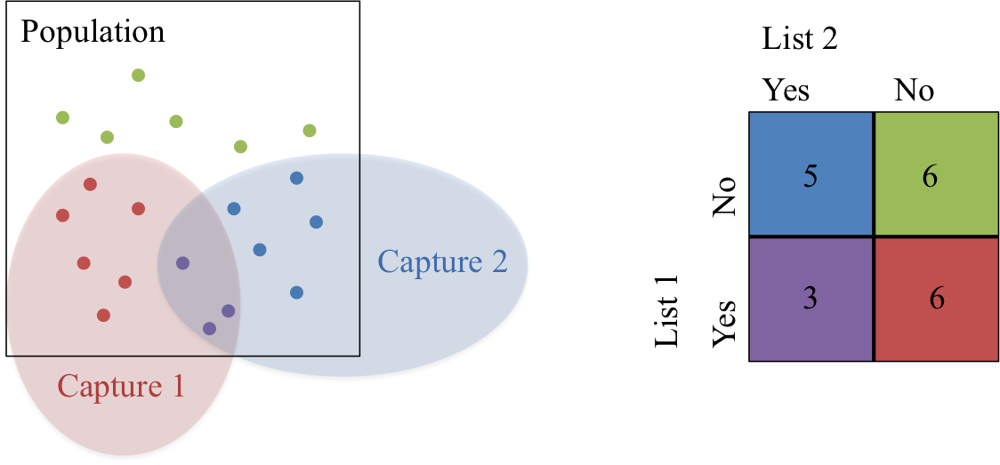

```{r setup, echo = FALSE, message=FALSE, warning=FALSE}
library(knitr)
library(ggplot2)
library(dplyr)
library(tidyr)
library(RefManageR)
library(dga)
library(kableExtra)

## chunk options
opts_chunk$set(echo = FALSE, message=FALSE, warning=FALSE)

## plot options
theme_set(theme_bw(base_family = "serif"))
```

# {.col-2 style="grid-row: span 4;"}
<!-- Span the first column for four rows, that way we can capture the usage block, two rows of template examples, and refs/footer information -->

## Overview

Provide an estimate for population size from multiple noisy capture datasets and quantify uncertainty in that estimate using Bayesian methods.

## Motivating example


- "Historically, these numbers matter... because they can have a direct impact on policy, accountability and a global sense of urgency."[@nytimes]
- Duplicated information regarding information about who has died from multiple sources (NGOs)
- Messy overlapping datasets with errors
- String data (names) as identifiers

  
**Goal: ** Count the (population of) casualties and *quantify the uncertainty* in the estimate.


## Graphical Record Linkage (RL) 

#### {.fullwidth}

*Record linkage* is merging together multiple datasets that have duplicate entries, often in the absence of a unique identifier.

<p style="text-align:center;">
{style="width:75%;"} 
</p>

### Bayesian Hierarchical Model

Latent clustering approach [@steorts2015entity] with a package on CRAN (`blink`)[@blink]

<p style="text-align:center;">
{style="width:60%;"} 
</p>

## Capture-recapture Methods (CRC)

#### {.fullwidth}

*Capture-recapture (CRC)* is a method used to estimate a closed population's size through the use of mark-release-recapture.


<p style="text-align:center;">
{style="width:75%;"} 
</p>

### Bayesian Model Averaging (BMA)

```{r dga_graphs}
data("graphs3")
data("graphs4")
data("graphs5")
```

- Model averaging approach allows for various types of dependency between lists through the use of decomposable Bayesian graphical models [@madigan1997bayesian] with a package on CRAN (`dga`) [@dga]
- **Likelihood** Bayesian hierarchical log-linear models given model with certain dependency between lists
- **Priors** $t$-distribution for log-linear parameters, $p(N) \propto N^{-1}$
- Models averaged over all decomposable Bayesian graphical models to obtain final posterior distribution
- For $3$ lists, this corresponds to `r length(graphs3)` models, $4$ lists - `r length(graphs4)` models, $5$ lists - `r length(graphs5)` models

### Bayesian NP Latent Class Model (NPLCM)

- Assumes independence between lists, used to model heterogeneity in the capture probabilities [@manrique2016bayesian] with a package on CRAN (`LCMCR`)  [@LCMCR]
- **Likelihood** Multinomial multiple-capture estimation with finite mixture models for probability of capture where each component in the mixture has stratum-specific parameters 
- **Priors** Dirichlet process model for strata mixture weights, $\text{Beta}(1,1)$ for stratum-specific capture probabilities
- No need to specify the number of strata
- Can handle large numbers of recapture with moderate sample size

# {.col-2}

## RL + CRC


## Simulated Data Example

```{r load}
load("../../../data/geco_sim/geco_5dup_5dist_2num.Rdata")
```

- Generated data in `r length(noisy_dup_db)` lists according to the following stratified capture probabilities

```{r, results='asis'}
inclusion %>%
  mutate(db = paste("List", db)) %>%
  spread(db, inclusion) %>%
  rename(Strata = strata, Proportion = prop) %>%
  kable(digits = 2, format = "html", row.names = FALSE)
```

#### {.fullwidth}

- Strata are (1) large & hard to capture and (2) small & easy to capture population
- Add additional duplicates within each database at a 5% level
- Distort the duplicates -- strings are distorted at three levels: $5\%, 10\%, 15\%$ of characters

```{r, results = 'asis'}
noisy_dup_db[[1]] %>%
  tail(10) %>%
  head(3) %>%
  kable(format = "html", row.names = FALSE)
```

## Results and Performance

#### {.fullwidth}

```{r load-results, cache = TRUE}
## load results ---
## nplcm
load("../../../results/geco_sim/crc_5dup_5dist.Rdata")
pop_N <- data.frame(dist = 5, crc_method = "NPLCM", method = "Truth", N = pop_N_truth)
pop_N <- rbind(pop_N, data.frame(dist = 5, crc_method = "NPLCM", method = "Shared MPMMS", N = pop_N_mpmms))
pop_N <- rbind(pop_N, data.frame(dist = 5, crc_method = "NPLCM", method = "U(N)", N = as.numeric(pop_N_bayes)))
min_5_nplcm <- min(c(pop_N_truth, pop_N_mpmms, pop_N_bayes))
max_5_nplcm <- max(c(pop_N_truth, pop_N_mpmms, pop_N_bayes))
pop_N_bayes_5_nplcm <- pop_N_bayes
pop_N_truth_5_nplcm <- pop_N_truth
pop_N_mpmms_5_nplcm <- pop_N_mpmms

load("../../../results/geco_sim/crc_5dup_10dist.Rdata")
pop_N <- rbind(pop_N, data.frame(dist = 10, crc_method = "NPLCM", method = "Truth", N = pop_N_truth))
pop_N <- rbind(pop_N, data.frame(dist = 10, crc_method = "NPLCM", method = "Shared MPMMS", N = pop_N_mpmms))
pop_N <- rbind(pop_N, data.frame(dist = 10, crc_method = "NPLCM", method = "U(N)", N = as.numeric(pop_N_bayes)))
min_10_nplcm <- min(c(pop_N_truth, pop_N_mpmms, pop_N_bayes))
max_10_nplcm <- max(c(pop_N_truth, pop_N_mpmms, pop_N_bayes))
pop_N_bayes_10_nplcm <- pop_N_bayes
pop_N_truth_10_nplcm <- pop_N_truth
pop_N_mpmms_10_nplcm <- pop_N_mpmms

load("../../../results/geco_sim/crc_5dup_15dist.Rdata")
pop_N <- rbind(pop_N, data.frame(dist = 15, crc_method = "NPLCM", method = "Truth", N = pop_N_truth))
pop_N <- rbind(pop_N, data.frame(dist = 15, crc_method = "NPLCM", method = "Shared MPMMS", N = pop_N_mpmms))
pop_N <- rbind(pop_N, data.frame(dist = 15, crc_method = "NPLCM", method = "U(N)", N = as.numeric(pop_N_bayes)))
min_15_nplcm <- min(c(pop_N_truth, pop_N_mpmms, pop_N_bayes))
max_15_nplcm <- max(c(pop_N_truth, pop_N_mpmms, pop_N_bayes))
pop_N_bayes_15_nplcm <- pop_N_bayes
pop_N_truth_15_nplcm <- pop_N_truth
pop_N_mpmms_15_nplcm <- pop_N_mpmms

## bma
load("../../../results/geco_sim/bma_5dup_5dist.Rdata")
pop_N <- rbind(pop_N, data.frame(dist = 5, crc_method = "BMA", method = "Truth", N = pop_N_truth))
pop_N <- rbind(pop_N, data.frame(dist = 5, crc_method = "BMA", method = "Shared MPMMS", N = pop_N_mpmms))
pop_N <- rbind(pop_N, data.frame(dist = 5, crc_method = "BMA", method = "U(N)", N = as.numeric(pop_N_bayes)))
min_5_bma <- min(c(pop_N_truth, pop_N_mpmms, pop_N_bayes))
max_5_bma <- max(c(pop_N_truth, pop_N_mpmms, pop_N_bayes))
pop_N_bayes_5_bma <- pop_N_bayes
pop_N_truth_5_bma <- pop_N_truth
pop_N_mpmms_5_bma <- pop_N_mpmms

load("../../../results/geco_sim/bma_5dup_10dist.Rdata")
pop_N <- rbind(pop_N, data.frame(dist = 10, crc_method = "BMA", method = "Truth", N = pop_N_truth))
pop_N <- rbind(pop_N, data.frame(dist = 10, crc_method = "BMA", method = "Shared MPMMS", N = pop_N_mpmms))
pop_N <- rbind(pop_N, data.frame(dist = 10, crc_method = "BMA", method = "U(N)", N = as.numeric(pop_N_bayes)))
min_10_bma <- min(c(pop_N_truth, pop_N_mpmms, pop_N_bayes))
max_10_bma <- max(c(pop_N_truth, pop_N_mpmms, pop_N_bayes))
pop_N_bayes_10_bma <- pop_N_bayes
pop_N_truth_10_bma <- pop_N_truth
pop_N_mpmms_10_bma <- pop_N_mpmms

load("../../../results/geco_sim/bma_5dup_15dist.Rdata")
pop_N <- rbind(pop_N, data.frame(dist = 15, crc_method = "BMA", method = "Truth", N = pop_N_truth))
pop_N <- rbind(pop_N, data.frame(dist = 15, crc_method = "BMA", method = "Shared MPMMS", N = pop_N_mpmms))
pop_N <- rbind(pop_N, data.frame(dist = 15, crc_method = "BMA", method = "U(N)", N = as.numeric(pop_N_bayes)))
min_15_bma <- min(c(pop_N_truth, pop_N_mpmms, pop_N_bayes))
max_15_bma <- max(c(pop_N_truth, pop_N_mpmms, pop_N_bayes))
pop_N_bayes_15_bma <- pop_N_bayes
pop_N_truth_15_bma <- pop_N_truth
pop_N_mpmms_15_bma <- pop_N_mpmms

## make densities
n_bin <- 5000
min_tot <- min(min_5_nplcm, min_10_nplcm, min_15_nplcm, min_5_bma, min_10_bma, min_15_bma)
max_tot <- max(max_5_nplcm, max_10_nplcm, max_15_nplcm, max_5_bma, max_10_bma, max_15_bma)

## truth
pop_N_density <- rbind(data.frame(dist = 5, crc_method = "NPLCM",
                                  data.frame(density(pop_N_truth_5_nplcm, from = min_tot, to = max_tot, n = n_bin)[c("x", "y")])),
                       data.frame(dist = 10, crc_method = "NPLCM",
                                  data.frame(density(pop_N_truth_10_nplcm, from = min_tot, to = max_tot, n = n_bin)[c("x", "y")])),
                       data.frame(dist = 15, crc_method = "NPLCM",
                                  data.frame(density(pop_N_truth_15_nplcm, from = min_tot, to = max_tot, n = n_bin)[c("x", "y")])))
names(pop_N_density) <- c("dist", "crc_method", "x", "truth")
pop_N_density$x <- round(pop_N_density$x, 5)

## add mmpms
rbind(data.frame(dist = 5, crc_method = "NPLCM",
                 data.frame(density(pop_N_mpmms_5_nplcm, from = min_tot, to = max_tot, n = n_bin)[c("x", "y")])),
      data.frame(dist = 10, crc_method = "NPLCM",
                 data.frame(density(pop_N_mpmms_10_nplcm, from = min_tot, to = max_tot, n = n_bin)[c("x", "y")])),
      data.frame(dist = 15, crc_method = "NPLCM",
                 data.frame(density(pop_N_mpmms_15_nplcm, from = min_tot, to = max_tot, n = n_bin)[c("x", "y")]))) %>%
  rename(mpmms = y) %>% 
  mutate(x = round(x, 5)) %>%
  left_join(pop_N_density, by = c("dist","crc_method", "x")) -> pop_N_density

## add joint posterior
rbind(data.frame(dist = 5, crc_method = "NPLCM",
                 data.frame(density(as.numeric(pop_N_bayes_5_nplcm), from = min_tot, to = max_tot, n = n_bin)[c("x", "y")])),
      data.frame(dist = 10, crc_method = "NPLCM",
                 data.frame(density(as.numeric(pop_N_bayes_10_nplcm), from = min_tot, to = max_tot, n = n_bin)[c("x", "y")])),
      data.frame(dist = 15, crc_method = "NPLCM",
                 data.frame(density(as.numeric(pop_N_bayes_15_nplcm), from = min_tot, to = max_tot, n = n_bin)[c("x", "y")]))) %>%
  rename(joint_post = y) %>% 
  mutate(x = round(x, 5)) %>%
  left_join(pop_N_density, by = c("dist", "crc_method", "x")) -> pop_N_density

##bma
## truth
pop_N_density2 <- rbind(data.frame(dist = 5, crc_method = "BMA",
                                  data.frame(density(pop_N_truth_5_bma, from = min_tot, to = max_tot, n = n_bin)[c("x", "y")])),
                       data.frame(dist = 10, crc_method = "BMA",
                                  data.frame(density(pop_N_truth_10_bma, from = min_tot, to = max_tot, n = n_bin)[c("x", "y")])),
                       data.frame(dist = 15, crc_method = "BMA",
                                  data.frame(density(pop_N_truth_15_bma, from = min_tot, to = max_tot, n = n_bin)[c("x", "y")])))
names(pop_N_density2) <- c("dist", "crc_method", "x", "truth")
pop_N_density2$x <- round(pop_N_density2$x, 5)

## add mmpms
rbind(data.frame(dist = 5, crc_method = "BMA",
                 data.frame(density(pop_N_mpmms_5_bma, from = min_tot, to = max_tot, n = n_bin)[c("x", "y")])),
      data.frame(dist = 10, crc_method = "BMA",
                 data.frame(density(pop_N_mpmms_10_bma, from = min_tot, to = max_tot, n = n_bin)[c("x", "y")])),
      data.frame(dist = 15, crc_method = "BMA",
                 data.frame(density(pop_N_mpmms_15_bma, from = min_tot, to = max_tot, n = n_bin)[c("x", "y")]))) %>%
  rename(mpmms = y) %>% 
  mutate(x = round(x, 5)) %>%
  left_join(pop_N_density2, by = c("dist", "crc_method", "x")) -> pop_N_density2

## add joint posterior
rbind(data.frame(dist = 5, crc_method = "BMA",
                 data.frame(density(as.numeric(pop_N_bayes_5_bma), from = min_tot, to = max_tot, n = n_bin)[c("x", "y")])),
      data.frame(dist = 10, crc_method = "BMA",
                 data.frame(density(as.numeric(pop_N_bayes_10_bma), from = min_tot, to = max_tot, n = n_bin)[c("x", "y")])),
      data.frame(dist = 15, crc_method = "BMA",
                 data.frame(density(as.numeric(pop_N_bayes_15_bma), from = min_tot, to = max_tot, n = n_bin)[c("x", "y")]))) %>%
  rename(joint_post = y) %>% 
  mutate(x = round(x, 5)) %>%
  left_join(pop_N_density2, by = c("dist", "crc_method", "x")) -> pop_N_density2

pop_N_density <- rbind(pop_N_density, pop_N_density2)
```

```{r plot-results, fig.height=3}
pop_N_density %>%
  gather(method, y, -dist, -x, -crc_method) %>% 
  ggplot() +
  geom_line(aes(x, y, colour = method, linetype = crc_method)) +
  geom_polygon(aes(x, y, fill = method), alpha = .2) +
  geom_vline(aes(xintercept = 1000), lty = 1) +
  facet_wrap(~dist) +
  xlim(c(750, 1500)) +
  scale_fill_discrete("Record Linkage", labels = c("U(N)", "Shared MPMMS", "Truth")) +
  scale_colour_discrete("Record Linkage", labels = c("U(N)", "Shared MPMMS", "Truth")) +
  scale_linetype_discrete("CRC Method") +
  xlab("N") + ylab("")

```


```{r performance}
# load number incorrect
load("../../../results/geco_sim/crc_diag_5dup_5dist.Rdata")
mpmms_dsn_5 <- mpmms_dsn
lambda_dsn_5 <- lambda_dsn

load("../../../results/geco_sim/crc_diag_5dup_10dist.Rdata")
mpmms_dsn_10 <- mpmms_dsn
lambda_dsn_10 <- lambda_dsn

load("../../../results/geco_sim/crc_diag_5dup_15dist.Rdata")
mpmms_dsn_15 <- mpmms_dsn
lambda_dsn_15 <- lambda_dsn

## make dsn dfs
mpmms_dsn <- rbind(data.frame(dist = 5, mpmms_dsn_5), 
                   data.frame(dist = 10, mpmms_dsn_10), 
                   data.frame(dist = 15, mpmms_dsn_10))

bayes_dsn <- rbind(data.frame(dist = 5, lambda_dsn_5), 
                    data.frame(dist = 10, lambda_dsn_10), 
                    data.frame(dist = 15, lambda_dsn_10))

truth_dsn <- mpmms_dsn
truth_dsn$truth_clust_diff <- 0

## get MSE for N
## truth
pop_N %>%
  filter(method == "Truth") %>%
  group_by(dist, method, crc_method) %>%
  summarise(mean_diff = mean(N - 1000)) %>%
  mutate(iter = 1) -> truth_diff

## add dsn of rl errors
truth_diff <- truth_diff %>% left_join(truth_dsn)

## mpmms
pop_N %>%
  filter(method == "Shared MPMMS") %>%
  group_by(dist, method, crc_method) %>%
  summarise(mean_diff = mean(N - 1000)) %>%
  mutate(iter = 1) -> mpmms_diff

## add dsn of rl errors
mpmms_diff <- mpmms_diff %>% left_join(mpmms_dsn)

## bayes
data.frame(dist = 5, method = "U(N)", crc_method = "NPLCM", 
           mean_diff = apply(pop_N_bayes_5_nplcm, 2, function(N) mean(N - 1000))) %>%
  mutate(iter = 1:n()) %>%
  bind_rows(data.frame(dist = 5, method = "U(N)", crc_method = "BMA", 
           mean_diff = apply(pop_N_bayes_5_bma, 2, function(N) mean(N - 1000))) %>%
             mutate(iter = 1:n())) %>%
  bind_rows(data.frame(dist = 10, method = "U(N)", crc_method = "NPLCM", 
           mean_diff = apply(pop_N_bayes_10_nplcm, 2, function(N) mean(N - 1000))) %>%
             mutate(iter = 1:n())) %>%
  bind_rows(data.frame(dist = 10, method = "U(N)", crc_method = "BMA", 
           mean_diff = apply(pop_N_bayes_10_bma, 2, function(N) mean(N - 1000))) %>%
             mutate(iter = 1:n())) %>%
    bind_rows(data.frame(dist = 15, method = "U(N)", crc_method = "NPLCM", 
           mean_diff = apply(pop_N_bayes_10_nplcm, 2, function(N) mean(N - 1000))) %>%
             mutate(iter = 1:n())) %>%
  bind_rows(data.frame(dist = 15, method = "U(N)", crc_method = "BMA", 
           mean_diff = apply(pop_N_bayes_10_bma, 2, function(N) mean(N - 1000))) %>%
             mutate(iter = 1:n())) -> bayes_diff

## add dsn of rl errors
bayes_diff <- bayes_diff %>% left_join(bayes_dsn)

diff_df <- truth_diff %>%
  bind_rows(mpmms_diff) %>%
  bind_rows(bayes_diff)


diff_df %>% ungroup() %>%
  mutate(num_include = factor(num_include, labels = paste0("Number db = ", unique(num_include)))) %>%
  mutate(dist = factor(dist, labels = paste0("Distortion level = ", unique(dist)))) %>%
  ggplot() +
  geom_point(aes(truth_clust_diff, mean_diff, colour = method)) +
  geom_density_2d(aes(truth_clust_diff, mean_diff), colour = "black") +
  facet_grid(dist~num_include, scales = "free") +
  scale_colour_discrete("Record linkage") +
  xlab("Truth - RL Freq") +
  ylab(expression(E~group("(", N~ "|" ~X, ")") - 1000))


```

## Discussion

### Takeaways

- Full posterior estimation via MCMC is **computationally expensive**, point estimate from RL for CRC, less valid intervals
- NPLCM CRC method is for independent lists; works best for many lists ( $\ge 4$ ) 
- BMA CRC method does not scale beyond $5$ lists easily because need to precompute valid dependencies
- Both CRC methods sensitive to errors from RL and become biased

### To do

- Much more extensive simulation with different levels of duplication and list inclusion probabilities
- Alternative prior specification for Bayesian RL that prioritizes singletons
- Investigate CRC methods that are robust to misspecifications and incorporating additional information (duplication) from RL
- Do this on **real data**!


## References
