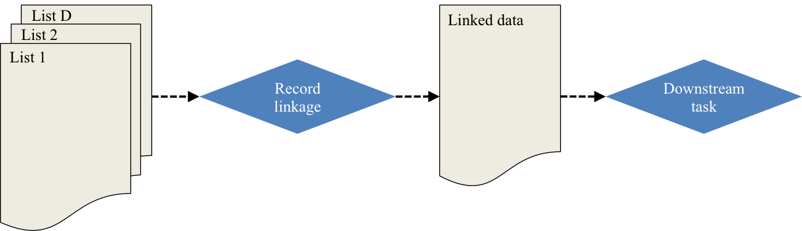

```{r setup, echo = FALSE, message=FALSE, warning=FALSE}
library(knitr)
library(ggplot2)
library(dplyr)
library(tidyr)
library(RefManageR)
library(dga)
library(kableExtra)

## chunk options
opts_chunk$set(echo = FALSE, message=FALSE, warning=FALSE)

## plot options
theme_set(theme_bw(base_family = "serif"))

## bibliography
options(htmltools.dir.version = FALSE)
BibOptions(check.entries = FALSE, bib.style = "authoryear", style = "markdown", dashed = TRUE)
bib <- ReadBib("refs.bib", check = FALSE)
```

# Motivating example

.pull-left[
```{r nytimes_image}
knitr::include_graphics("figure/nytimes_syria.png")
```
]

.pull-right[

- Duplicated information regarding information about who has died from multiple sources (NGOs)
- Messy overlapping datasets with errors
- String data (names) as identifiers
]

 >  Historically, these numbers matter... because they can have a direct impact on policy, accountability and a global sense of urgency.
 
 **Goal:** We want to count the (population) of casualties and *quantify the uncertainty* in this estimate.

.footnote[[1] https://www.nytimes.com/2018/04/13/world/middleeast/syria-death-toll.html]

---
# General terminology



* *Record linkage* is merging together multiple datasets that have duplicate entries (often in the absence of a unique identifier). 

* A *downstream task* is inference, prediction, or post-linkage analysis on the linked data. 
  - Examples: regression, clustering, small area estimation, sample size estimation, population size estimation, etc.

* *Capture-recapture (CRC)* is a method used to estimate a closed population's size through the use of mark-release-recapture.


---
# Proposed work

* Much work has focused on sample size estimation as the downstream task `r Citep(bib, c("steorts2016bayesian", "chen2017unique", "price2014updated", "sadinle2013generalized"))`
  - Some work on population size estimation post-linkage with uncertainty quantification `r Citep(bib, c("tancredi2011hierarchical", "liseo2011bayesian"))`

* We look at a general fully Bayesian approach, in the context of the downstream task

* Provide framework for record linkage and CRC, where we crucially account for the record linkage and model uncertainty 

---
# Probabilistic record linkage

*Record linkage* is merging together multiple datasets that have duplicate entries (often in the absence of a unique identifier). 

```{r, out.height = "400px"}

```

---
# Latent clustering approach

```{r, out.height = "500px"}

```

---
# Bayesian hierarchical model


---
# Capture-recapture

*Capture-recapture (CRC)* is a method used to estimate a closed population's size through the use of mark-release-recapture.


---
# Bayesian model averaging (BMA)

```{r dga_graphs}
data("graphs3")
data("graphs4")
data("graphs5")
```

- Method proposed by `r Citet(bib, "madigan1997bayesian")` with a package on CRAN (`dga`) `r Citep(bib, "dga")`

- Allows for various types of dependency between lists through the use of decomposable Bayesian graphical models

- **Likelihood** Bayesian hierarchical log-linear models given model with certain dependency between lists

- **Priors** $t$-distribution for log-linear parameters, Jeffreys prior for $N$, $p(N) \propto N^{-1}$

- Models averaged over all decomposable Bayesian graphical models to obtain final posterior distribution

 - For $3$ lists, this corresponds to `r length(graphs3)` models, $4$ lists - `r length(graphs4)` models, $5$ lists - `r length(graphs5)` models

---
# Bayesian NP latent class model (NPLCM)

- Proposed by `r Citet(bib, "manrique2016bayesian")` with a package on CRAN (`LCMCR`) `r Citep(bib, "LCMCR")`

- Assumes independence between lists, used to model heterogeneity in the capture probabilities

  - i.e. Homogenous strata in the population with different likelihood of being captured, but the same probability within
  

- **Likelihood** Multinomial multiple-capture estimation with finite mixture models for probability of capture where each component in the mixture has stratum-specific parameters 

- **Priors** Dirichlet process model for strata mixture weights, $\text{Beta}(1,1)$ for stratum-specific capture probabilities

- No need to specify the number of strata

- Can handle large numbers of recapture with moderate sample size


---
# Record linkage + CRC
 

 
```{r, results='hide'}
load("../../data/geco_sim/geco_5dup_5dist.Rdata")
idx <- do.call(c, identity) == 2

data.frame(list = c(1, 1, 1, 2, 2, 1)) %>%
  bind_cols(do.call(rbind, noisy_dup_db)[idx,] %>% bind_rows(noisy_dup_db[[1]][1:2,])) %>%
  kable(format = "html", row.names = FALSE)
```


```{r, out.height = "450px"}
knitr::include_graphics("figure/rl_crc.png")
```


---
# Propagating record linkage uncertainty

**Recall Goal: ** We want to count the (population) of casualties and *quantify the uncertainty* in this estimate.

**Challenge: ** How to quantify record linkage uncertainty after the record linkage task in finished and propagate this error into these subsequent analyses?

**One way: **

$$U(\eta) =: E_{\boldsymbol \lambda \mid \boldsymbol X} [p_C(\eta \mid f(\boldsymbol \lambda))] = \sum_{\boldsymbol \lambda} p_C(\eta \mid f(\boldsymbol \lambda)) p(\boldsymbol \lambda \mid \boldsymbol X) = p(\eta \mid \boldsymbol X)$$
$$\text{Var} (\eta \mid \boldsymbol X) = \text{Var}_{\boldsymbol \lambda \mid \boldsymbol X} [E[\eta \mid \boldsymbol \lambda ]] + E_{\boldsymbol \lambda \mid \boldsymbol X} [\text{Var}[\eta \mid \boldsymbol \lambda ]]$$

In practice, $U(\eta)$ and $\text{Var} (\eta \mid \boldsymbol X)$ must be estimated by Markov chain Monte carlo (MCMC).


---
# Another way

- Estimating $U(\eta)$ and $\text{Var} (\eta \mid \boldsymbol X)$ through MCMC can be computationally burdensome.

- Could also consider $p_C(\eta \mid f(\hat{\boldsymbol \lambda}))$, where $\hat{\boldsymbol \lambda}$ is a point estimate for $\boldsymbol \lambda | \boldsymbol X$ given by the shared most probable matching sets `r Citep(bib, "steorts2016bayesian")`

- Upside: Much faster, only need to do MCMC estimation of the CRC for a single linkage value

- Downside: error doesn't propogate through CRC task in an obvious way

---
# Simulated examples

- Generated data in `r length(noisy_dup_db)` lists according to the following stratified capture probabilities

```{r, results='asis'}
inclusion %>%
  mutate(db = paste("List", db)) %>%
  spread(db, inclusion) %>%
  rename(Strata = strata, Proportion = prop) %>%
  kable(digits = 2, format = "html", row.names = FALSE)
```

- Strata correspond to (1) a large & hard to capture population and (2) a small & easy to capture population.

- Add additional duplicates within each database at a 5% level

- Distort the duplicates (both between and within). String fields are distorted at three different levels: $5\%, 10\%, 15\%$ of characters

---
# Simulated data

```{r, results = 'asis'}
noisy_dup_db[[1]] %>%
  tail(10) %>%
  kable(format = "html", row.names = FALSE)
```

---
# Results

```{r load-results, cache = TRUE}
## load results ---
## nplcm
load("../../results/geco_sim/crc_5dup_5dist.Rdata")
pop_N <- data.frame(dist = 5, crc_method = "NPLCM", method = "Truth", N = pop_N_truth)
pop_N <- rbind(pop_N, data.frame(dist = 5, crc_method = "NPLCM", method = "Shared MPMMS", N = pop_N_mpmms))
pop_N <- rbind(pop_N, data.frame(dist = 5, crc_method = "NPLCM", method = "U(N)", N = as.numeric(pop_N_bayes)))
min_5_nplcm <- min(c(pop_N_truth, pop_N_mpmms, pop_N_bayes))
max_5_nplcm <- max(c(pop_N_truth, pop_N_mpmms, pop_N_bayes))
pop_N_bayes_5_nplcm <- pop_N_bayes
pop_N_truth_5_nplcm <- pop_N_truth
pop_N_mpmms_5_nplcm <- pop_N_mpmms

load("../../results/geco_sim/crc_5dup_10dist.Rdata")
pop_N <- rbind(pop_N, data.frame(dist = 10, crc_method = "NPLCM", method = "Truth", N = pop_N_truth))
pop_N <- rbind(pop_N, data.frame(dist = 10, crc_method = "NPLCM", method = "Shared MPMMS", N = pop_N_mpmms))
pop_N <- rbind(pop_N, data.frame(dist = 10, crc_method = "NPLCM", method = "U(N)", N = as.numeric(pop_N_bayes)))
min_10_nplcm <- min(c(pop_N_truth, pop_N_mpmms, pop_N_bayes))
max_10_nplcm <- max(c(pop_N_truth, pop_N_mpmms, pop_N_bayes))
pop_N_bayes_10_nplcm <- pop_N_bayes
pop_N_truth_10_nplcm <- pop_N_truth
pop_N_mpmms_10_nplcm <- pop_N_mpmms

load("../../results/geco_sim/crc_5dup_15dist.Rdata")
pop_N <- rbind(pop_N, data.frame(dist = 15, crc_method = "NPLCM", method = "Truth", N = pop_N_truth))
pop_N <- rbind(pop_N, data.frame(dist = 15, crc_method = "NPLCM", method = "Shared MPMMS", N = pop_N_mpmms))
pop_N <- rbind(pop_N, data.frame(dist = 15, crc_method = "NPLCM", method = "U(N)", N = as.numeric(pop_N_bayes)))
min_15_nplcm <- min(c(pop_N_truth, pop_N_mpmms, pop_N_bayes))
max_15_nplcm <- max(c(pop_N_truth, pop_N_mpmms, pop_N_bayes))
pop_N_bayes_15_nplcm <- pop_N_bayes
pop_N_truth_15_nplcm <- pop_N_truth
pop_N_mpmms_15_nplcm <- pop_N_mpmms

## bma
load("../../results/geco_sim/bma_5dup_5dist.Rdata")
pop_N <- rbind(pop_N, data.frame(dist = 5, crc_method = "BMA", method = "Truth", N = pop_N_truth))
pop_N <- rbind(pop_N, data.frame(dist = 5, crc_method = "BMA", method = "Shared MPMMS", N = pop_N_mpmms))
pop_N <- rbind(pop_N, data.frame(dist = 5, crc_method = "BMA", method = "U(N)", N = as.numeric(pop_N_bayes)))
min_5_bma <- min(c(pop_N_truth, pop_N_mpmms, pop_N_bayes))
max_5_bma <- max(c(pop_N_truth, pop_N_mpmms, pop_N_bayes))
pop_N_bayes_5_bma <- pop_N_bayes
pop_N_truth_5_bma <- pop_N_truth
pop_N_mpmms_5_bma <- pop_N_mpmms

load("../../results/geco_sim/bma_5dup_10dist.Rdata")
pop_N <- rbind(pop_N, data.frame(dist = 10, crc_method = "BMA", method = "Truth", N = pop_N_truth))
pop_N <- rbind(pop_N, data.frame(dist = 10, crc_method = "BMA", method = "Shared MPMMS", N = pop_N_mpmms))
pop_N <- rbind(pop_N, data.frame(dist = 10, crc_method = "BMA", method = "U(N)", N = as.numeric(pop_N_bayes)))
min_10_bma <- min(c(pop_N_truth, pop_N_mpmms, pop_N_bayes))
max_10_bma <- max(c(pop_N_truth, pop_N_mpmms, pop_N_bayes))
pop_N_bayes_10_bma <- pop_N_bayes
pop_N_truth_10_bma <- pop_N_truth
pop_N_mpmms_10_bma <- pop_N_mpmms

load("../../results/geco_sim/bma_5dup_15dist.Rdata")
pop_N <- rbind(pop_N, data.frame(dist = 15, crc_method = "BMA", method = "Truth", N = pop_N_truth))
pop_N <- rbind(pop_N, data.frame(dist = 15, crc_method = "BMA", method = "Shared MPMMS", N = pop_N_mpmms))
pop_N <- rbind(pop_N, data.frame(dist = 15, crc_method = "BMA", method = "U(N)", N = as.numeric(pop_N_bayes)))
min_15_bma <- min(c(pop_N_truth, pop_N_mpmms, pop_N_bayes))
max_15_bma <- max(c(pop_N_truth, pop_N_mpmms, pop_N_bayes))
pop_N_bayes_15_bma <- pop_N_bayes
pop_N_truth_15_bma <- pop_N_truth
pop_N_mpmms_15_bma <- pop_N_mpmms

## make densities
n_bin <- 5000
min_tot <- min(min_5_nplcm, min_10_nplcm, min_15_nplcm, min_5_bma, min_10_bma, min_15_bma)
max_tot <- max(max_5_nplcm, max_10_nplcm, max_15_nplcm, max_5_bma, max_10_bma, max_15_bma)

## truth
pop_N_density <- rbind(data.frame(dist = 5, crc_method = "NPLCM",
                                  data.frame(density(pop_N_truth_5_nplcm, from = min_tot, to = max_tot, n = n_bin)[c("x", "y")])),
                       data.frame(dist = 10, crc_method = "NPLCM",
                                  data.frame(density(pop_N_truth_10_nplcm, from = min_tot, to = max_tot, n = n_bin)[c("x", "y")])),
                       data.frame(dist = 15, crc_method = "NPLCM",
                                  data.frame(density(pop_N_truth_15_nplcm, from = min_tot, to = max_tot, n = n_bin)[c("x", "y")])))
names(pop_N_density) <- c("dist", "crc_method", "x", "truth")
pop_N_density$x <- round(pop_N_density$x, 5)

## add mmpms
rbind(data.frame(dist = 5, crc_method = "NPLCM",
                 data.frame(density(pop_N_mpmms_5_nplcm, from = min_tot, to = max_tot, n = n_bin)[c("x", "y")])),
      data.frame(dist = 10, crc_method = "NPLCM",
                 data.frame(density(pop_N_mpmms_10_nplcm, from = min_tot, to = max_tot, n = n_bin)[c("x", "y")])),
      data.frame(dist = 15, crc_method = "NPLCM",
                 data.frame(density(pop_N_mpmms_15_nplcm, from = min_tot, to = max_tot, n = n_bin)[c("x", "y")]))) %>%
  rename(mpmms = y) %>% 
  mutate(x = round(x, 5)) %>%
  left_join(pop_N_density, by = c("dist","crc_method", "x")) -> pop_N_density

## add joint posterior
rbind(data.frame(dist = 5, crc_method = "NPLCM",
                 data.frame(density(as.numeric(pop_N_bayes_5_nplcm), from = min_tot, to = max_tot, n = n_bin)[c("x", "y")])),
      data.frame(dist = 10, crc_method = "NPLCM",
                 data.frame(density(as.numeric(pop_N_bayes_10_nplcm), from = min_tot, to = max_tot, n = n_bin)[c("x", "y")])),
      data.frame(dist = 15, crc_method = "NPLCM",
                 data.frame(density(as.numeric(pop_N_bayes_15_nplcm), from = min_tot, to = max_tot, n = n_bin)[c("x", "y")]))) %>%
  rename(joint_post = y) %>% 
  mutate(x = round(x, 5)) %>%
  left_join(pop_N_density, by = c("dist", "crc_method", "x")) -> pop_N_density

##bma
## truth
pop_N_density2 <- rbind(data.frame(dist = 5, crc_method = "BMA",
                                  data.frame(density(pop_N_truth_5_bma, from = min_tot, to = max_tot, n = n_bin)[c("x", "y")])),
                       data.frame(dist = 10, crc_method = "BMA",
                                  data.frame(density(pop_N_truth_10_bma, from = min_tot, to = max_tot, n = n_bin)[c("x", "y")])),
                       data.frame(dist = 15, crc_method = "BMA",
                                  data.frame(density(pop_N_truth_15_bma, from = min_tot, to = max_tot, n = n_bin)[c("x", "y")])))
names(pop_N_density2) <- c("dist", "crc_method", "x", "truth")
pop_N_density2$x <- round(pop_N_density2$x, 5)

## add mmpms
rbind(data.frame(dist = 5, crc_method = "BMA",
                 data.frame(density(pop_N_mpmms_5_bma, from = min_tot, to = max_tot, n = n_bin)[c("x", "y")])),
      data.frame(dist = 10, crc_method = "BMA",
                 data.frame(density(pop_N_mpmms_10_bma, from = min_tot, to = max_tot, n = n_bin)[c("x", "y")])),
      data.frame(dist = 15, crc_method = "BMA",
                 data.frame(density(pop_N_mpmms_15_bma, from = min_tot, to = max_tot, n = n_bin)[c("x", "y")]))) %>%
  rename(mpmms = y) %>% 
  mutate(x = round(x, 5)) %>%
  left_join(pop_N_density2, by = c("dist", "crc_method", "x")) -> pop_N_density2

## add joint posterior
rbind(data.frame(dist = 5, crc_method = "BMA",
                 data.frame(density(as.numeric(pop_N_bayes_5_bma), from = min_tot, to = max_tot, n = n_bin)[c("x", "y")])),
      data.frame(dist = 10, crc_method = "BMA",
                 data.frame(density(as.numeric(pop_N_bayes_10_bma), from = min_tot, to = max_tot, n = n_bin)[c("x", "y")])),
      data.frame(dist = 15, crc_method = "BMA",
                 data.frame(density(as.numeric(pop_N_bayes_15_bma), from = min_tot, to = max_tot, n = n_bin)[c("x", "y")]))) %>%
  rename(joint_post = y) %>% 
  mutate(x = round(x, 5)) %>%
  left_join(pop_N_density2, by = c("dist", "crc_method", "x")) -> pop_N_density2

pop_N_density <- rbind(pop_N_density, pop_N_density2)
```

```{r plot-results}
pop_N_density %>%
  gather(method, y, -dist, -x, -crc_method) %>% 
  ggplot() +
  geom_line(aes(x, y, colour = method, linetype = crc_method)) +
  geom_polygon(aes(x, y, fill = method), alpha = .2) +
  geom_vline(aes(xintercept = 1000), lty = 1) +
  facet_wrap(~dist) +
  xlim(c(750, 1500)) +
  scale_fill_discrete("Record Linkage", labels = c("U(N)", "Shared MPMMS", "Truth")) +
  scale_colour_discrete("Record Linkage", labels = c("U(N)", "Shared MPMMS", "Truth")) +
  scale_linetype_discrete("CRC Method") +
  xlab("N") + ylab("")

```

---
# Results (Distortion Level = 5)

```{r results-table-5, results='asis'}
pop_N %>%
  group_by(dist, crc_method, method) %>%
  summarise(mean_N = mean(N), q05_N = quantile(N, probs = 0.025), q95_N = quantile(N, probs = 0.975), MSE = mean((N - 1000)^2)) -> pop_N_summary_stats


pop_N_summary_stats %>% 
  group_by(method, add = TRUE) %>% 
  transmute(bold = 1000 >= q05_N & 1000 <= q95_N) %>%
  arrange(dist, method, crc_method) -> which_bold
  

pop_N_summary_stats %>% 
  arrange(dist, method, crc_method) %>% 
  mutate(ci_90 = paste0("(", round(q05_N, 2), ", ", round(q95_N, 2), ")")) %>%
  filter(dist == 5) %>%
  rename_("CRC method" = "crc_method", "Record Linkage" = "method",
          "Mean" = "mean_N", "95% CI" = "ci_90") %>%
  ungroup() %>%
  select(-q05_N, -q95_N, -dist) %>%
  kable(format = "html", row.names = FALSE) %>%
  row_spec(which(which_bold %>% filter(dist == 5) %>% .$bold), bold = TRUE)
```

---
# Results (Distortion Level = 10)

```{r results-table-10, results='asis'}

pop_N_summary_stats %>% 
  arrange(dist, method, crc_method) %>% 
  mutate(ci_90 = paste0("(", round(q05_N, 2), ", ", round(q95_N, 2), ")")) %>%
  filter(dist == 10) %>%
  rename_("CRC method" = "crc_method", "Record Linkage" = "method",
          "Mean" = "mean_N", "95% CI" = "ci_90") %>%
  ungroup() %>%
  select(-q05_N, -q95_N, -dist) %>%
  kable(format = "html", row.names = FALSE) %>%
  row_spec(which(which_bold %>% filter(dist == 10) %>% .$bold), bold = TRUE)
```


---
# Results (Distortion Level = 15)

```{r results-table-15, results='asis'}

pop_N_summary_stats %>% 
  arrange(dist, method, crc_method) %>% 
  mutate(ci_90 = paste0("(", round(q05_N, 2), ", ", round(q95_N, 2), ")")) %>%
  filter(dist == 15) %>%
  rename_("CRC method" = "crc_method", "Record Linkage" = "method",
          "Mean" = "mean_N", "95% CI" = "ci_90") %>%
  ungroup() %>%
  select(-q05_N, -q95_N, -dist) %>%
  kable(format = "html", row.names = FALSE) %>%
  row_spec(which(which_bold %>% filter(dist == 15) %>% .$bold), bold = TRUE)
```

---
# Intuition on performance

```{r performance}
# load number incorrect
load("../../results/geco_sim/crc_diag_5dup_5dist.Rdata")
mpmms_dsn_5 <- mpmms_dsn
lambda_dsn_5 <- lambda_dsn

load("../../results/geco_sim/crc_diag_5dup_10dist.Rdata")
mpmms_dsn_10 <- mpmms_dsn
lambda_dsn_10 <- lambda_dsn

load("../../results/geco_sim/crc_diag_5dup_15dist.Rdata")
mpmms_dsn_15 <- mpmms_dsn
lambda_dsn_15 <- lambda_dsn

## make dsn dfs
mpmms_dsn <- rbind(data.frame(dist = 5, mpmms_dsn_5), 
                   data.frame(dist = 10, mpmms_dsn_10), 
                   data.frame(dist = 15, mpmms_dsn_10))

bayes_dsn <- rbind(data.frame(dist = 5, lambda_dsn_5), 
                    data.frame(dist = 10, lambda_dsn_10), 
                    data.frame(dist = 15, lambda_dsn_10))

truth_dsn <- mpmms_dsn
truth_dsn$truth_clust_diff <- 0

## get MSE for N
## truth
pop_N %>%
  filter(method == "Truth") %>%
  group_by(dist, method, crc_method) %>%
  summarise(mean_diff = mean(N - 1000)) %>%
  mutate(iter = 1) -> truth_diff

## add dsn of rl errors
truth_diff <- truth_diff %>% left_join(truth_dsn)

## mpmms
pop_N %>%
  filter(method == "Shared MPMMS") %>%
  group_by(dist, method, crc_method) %>%
  summarise(mean_diff = mean(N - 1000)) %>%
  mutate(iter = 1) -> mpmms_diff

## add dsn of rl errors
mpmms_diff <- mpmms_diff %>% left_join(mpmms_dsn)

## bayes
data.frame(dist = 5, method = "U(N)", crc_method = "NPLCM", 
           mean_diff = apply(pop_N_bayes_5_nplcm, 2, function(N) mean(N - 1000))) %>%
  mutate(iter = 1:n()) %>%
  bind_rows(data.frame(dist = 5, method = "U(N)", crc_method = "BMA", 
           mean_diff = apply(pop_N_bayes_5_bma, 2, function(N) mean(N - 1000))) %>%
             mutate(iter = 1:n())) %>%
  bind_rows(data.frame(dist = 10, method = "U(N)", crc_method = "NPLCM", 
           mean_diff = apply(pop_N_bayes_10_nplcm, 2, function(N) mean(N - 1000))) %>%
             mutate(iter = 1:n())) %>%
  bind_rows(data.frame(dist = 10, method = "U(N)", crc_method = "BMA", 
           mean_diff = apply(pop_N_bayes_10_bma, 2, function(N) mean(N - 1000))) %>%
             mutate(iter = 1:n())) %>%
    bind_rows(data.frame(dist = 15, method = "U(N)", crc_method = "NPLCM", 
           mean_diff = apply(pop_N_bayes_10_nplcm, 2, function(N) mean(N - 1000))) %>%
             mutate(iter = 1:n())) %>%
  bind_rows(data.frame(dist = 15, method = "U(N)", crc_method = "BMA", 
           mean_diff = apply(pop_N_bayes_10_bma, 2, function(N) mean(N - 1000))) %>%
             mutate(iter = 1:n())) -> bayes_diff

## add dsn of rl errors
bayes_diff <- bayes_diff %>% left_join(bayes_dsn)

diff_df <- truth_diff %>%
  bind_rows(mpmms_diff) %>%
  bind_rows(bayes_diff)

diff_df %>% ungroup() %>%
  mutate(multi_db = factor(num_include > 1, labels = c("Singletons", "One or more db"))) %>%
  mutate(dist = factor(dist, labels = paste0("Distortion level = ", unique(dist)))) %>%
  group_by(multi_db, dist, method, crc_method, iter) %>%
  summarise(truth_clust_diff = sum(truth_clust_diff),
            mean_diff = mean(mean_diff)) %>%
  ggplot() +
  geom_point(aes(truth_clust_diff, mean_diff, colour = method)) +
  geom_density_2d(aes(truth_clust_diff, mean_diff), colour = "black") +
  facet_grid(dist~multi_db, scales = "free") +
  scale_colour_discrete("Record linkage") +
  xlab("Number missed in RL") +
  ylab(expression(E~group("(", N|X, ")") - 1000))


```

---
# Challenges


- MCMC for estimation of $U(\eta)$ and $\text{Var} (\eta \mid \boldsymbol X)$ is **computationally expensive**, but using the shared MPMMS does not work very well. 

- NPLCM CRC method is for independent lists. In our (limited) experience, this CRC method works best for many lists ( $\ge 4$ ). 

- BMA CRC method does not scale beyond $5$ lists easily because of the need to precompute all valid dependency structures between lists. 

- Both CRC methods sensitive to errors from RL and become biased. Especially if only using the shared MPMMS.

## To do

- Much more extensive simulation with different levels of duplication and list inclusion probabilities.

- Do this on **real data**!


---
# Thank you

## Questions?

### Slides - <http://bit.ly/isba-2018>

### Contact

* Email - <andrea.kaplan@duke.edu>
* Twitter - <http://twitter.com/andeekaplan>
* GitHub - <http://github.com/andeek>

---
# Notation

$\boldsymbol X=(X_1,\ldots,X_n)$, records comprised of $D$ databases, indexed by $i$   

$i$th database has $n_i$ observed records, indexed by $j$  

Each record corresponds to one of $M$ latent entities, indexed by $j'$  

Each record or latent entity has values on $p$ fields, indexed by $\ell$, assumed to be categorical or string  

$M_\ell$, the number of possible categorical values for the $\ell$th field  

$X_{ij\ell}$, observed value of the $\ell$th field for the $j$th record in the $i$th database  

$Y_{j'\ell}$, true value of the $\ell$th field for the $j'$th latent entity  

$\Lambda_{ij}$, latent entity to which the $j$th record in the $i$th database corresponds  

$\boldsymbol \Lambda = \{\Lambda_{ij}: i = 1, \dots, D, j = 1, \dots, n_i\}$   

$z_{ij\ell}=I(X_{ij\ell}\ne Y_{\Lambda_{ij}\ell})$, distortion indicator  

---
# Bayesian hierarchical model for RL

$$X_{ij\ell} \mid \Lambda_{ij},\,Y_{\Lambda_{ij}\ell},\,z_{ij\ell} \stackrel{\text{ind}}{\sim}\begin{cases}\delta(Y_{\Lambda_{ij}\ell})&\text{ if }z_{ij\ell}=0\\F_\ell(Y_{\Lambda_{ij}\ell})&\text{ if }z_{ij\ell}=1, \ell\le p_s\\G_\ell&\text{ if }z_{ij\ell}=1, \ell>p_s\end{cases}$$
$$Y_{j'\ell}\stackrel{\text{ind}}{\sim}G_\ell$$
$$z_{ij\ell}\mid\beta_{i\ell}\stackrel{\text{ind}}{\sim}\text{Bernoulli}(\beta_{i\ell})$$
$$\beta_{i\ell} \mid a,b \stackrel{\text{ind}}{\sim}\text{Beta}(a,b)$$
$$\Lambda_{ij} \mid M\stackrel{\text{ind}}{\sim}\text{Uniform}\left(1,\ldots, M\right)$$


---
# Bayesian nonparametric latent class model

$$f(\boldsymbol q | \boldsymbol \gamma, \boldsymbol \pi) = \sum\limits_{k = 1}^{K^*} \pi_k \prod\limits_{j = 1}^D \gamma_{jk}^{q_j}(1-\gamma{jk})^{1-q_j},$$
$$(\pi_1, \dots, \pi_{K^*}) \sim \text{SB}_{K^*}(\alpha)$$
$$\gamma_{jk} \stackrel{iid}{\sim} \text{Beta}(a_\gamma, b_\gamma)$$
$$\alpha \sim \text{Gamma}(a_\alpha, b_\alpha)$$
$$p(N) \propto \frac{1}{N}$$

---
# Trace plots


---
# Precision and recall


---
# References

.small[
```{r print_refs, results='asis'}
PrintBibliography(bib)
```
]
