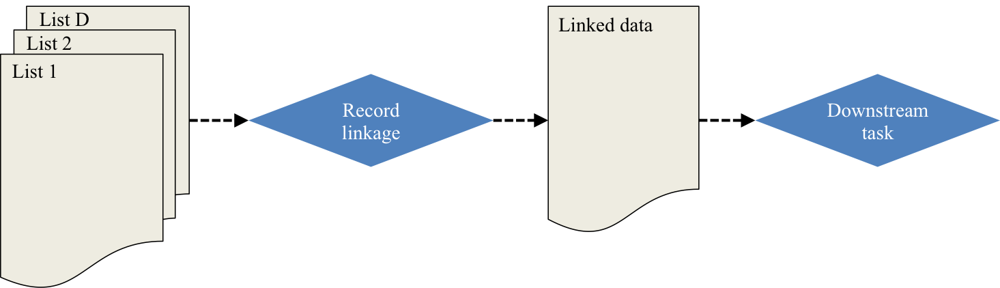
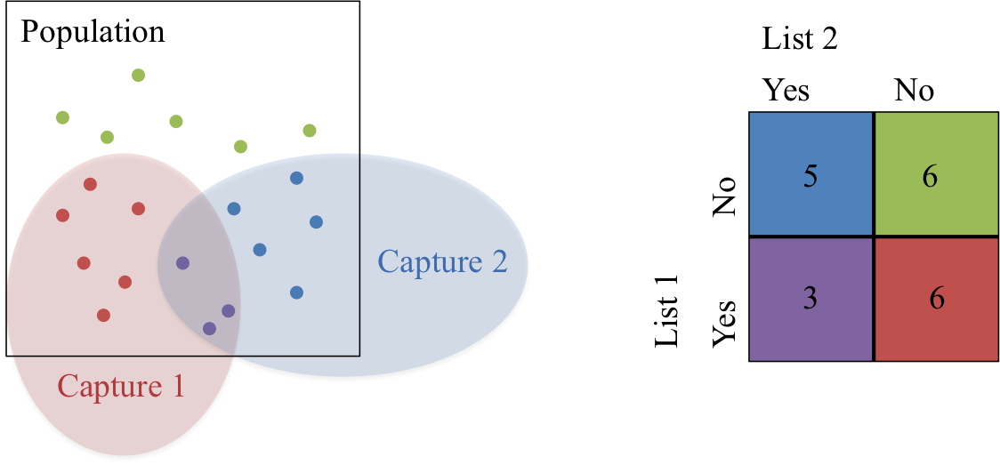
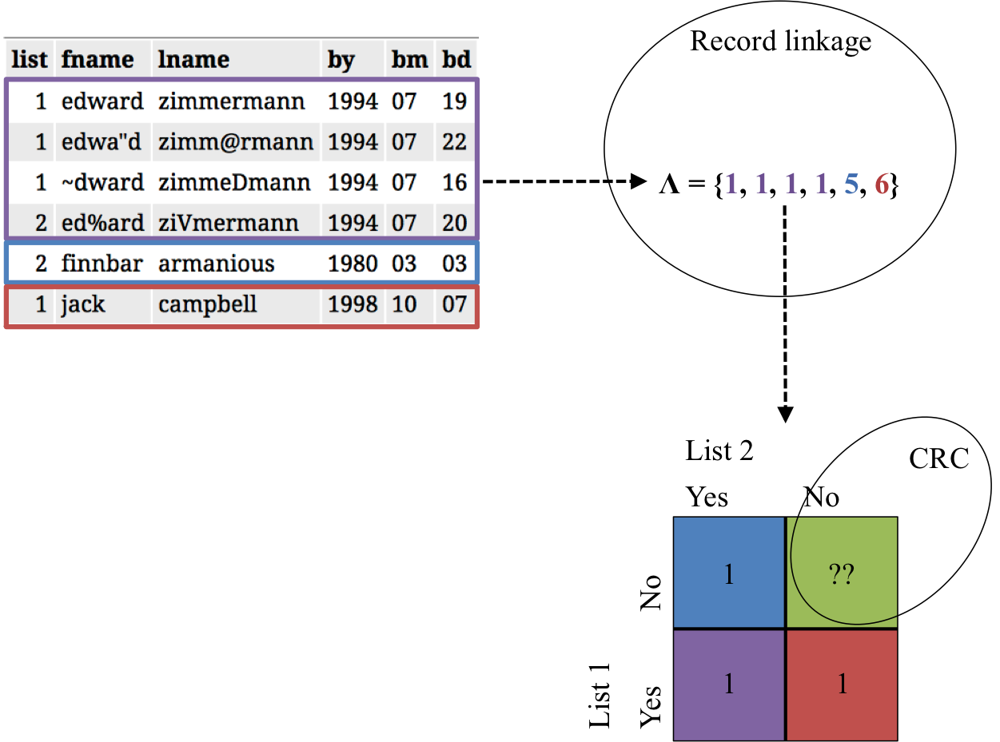

```{r setup, echo = FALSE, message=FALSE, warning=FALSE}
library(knitr)
library(ggplot2)
library(dplyr)
library(tidyr)
library(RefManageR)
library(dga)
library(kableExtra)

## chunk options
opts_chunk$set(echo = FALSE, message=FALSE, warning=FALSE)

## plot options
theme_set(theme_bw(base_family = "serif"))

## bibliography
options(htmltools.dir.version = FALSE)
BibOptions(check.entries = FALSE, bib.style = "authoryear", style = "markdown", dashed = TRUE)
bib <- ReadBib("../resources/refs.bib", check = FALSE)
```

# Motivating example

.pull-left[
```{r nytimes_image}
knitr::include_graphics("../resources/figure/nytimes_syria.png")
```
]

.pull-right[

- Duplicated information regarding information about who has died from multiple sources (NGOs)
- Messy overlapping data sets with errors
- String data (names) as identifiers
]

 >  Historically, these numbers matter... because they can have a direct impact on policy, accountability and a global sense of urgency.
 
 **Goal:** We want to count the (population) of casualties and *quantify the uncertainty* in this estimate.

.footnote[[1] https://www.nytimes.com/2018/04/13/world/middleeast/syria-death-toll.html]

---
# General terminology



* *Record linkage* is merging together multiple data sets that have duplicate entries (often in the absence of a unique identifier). 

* A *downstream task* is inference, prediction, or post-linkage analysis on the linked data. 
  - Examples: regression, clustering, small area estimation, sample size estimation, population size estimation, etc.

* *Capture-recapture (CRC)* is a method used to estimate a closed population's size through the use of mark-release-recapture.


---
# Proposed work

* Much work has focused on sample size estimation as the downstream task `r Citep(bib, c("steorts2016bayesian", "chen2017unique", "price2014updated", "sadinle2013generalized"))`
  - Some work on population size estimation post-linkage with uncertainty quantification `r Citep(bib, c("tancredi2011hierarchical", "liseo2011bayesian"))`

* We look at a general fully Bayesian approach, in the context of the downstream task

* Provide framework for record linkage and CRC, where we crucially account for the record linkage and model uncertainty 

---
# Probabilistic record linkage

*Record linkage* is merging together multiple data sets that have duplicate entries (often in the absence of a unique identifier). 

```{r, out.height = "400px"}

```

---
# Latent clustering approach

```{r, out.height = "500px"}
knitr::include_graphics("../resources/figure/rl_latent.png")
```

---
# Bayesian hierarchical model

Proposed by `r Citet(bib, "steorts2015entity")` with a package on CRAN (`blink`) `r Citep(bib, "blink")`


---
# Capture-recapture

*Capture-recapture (CRC)* is a method used to estimate a closed population's size through the use of mark-release-recapture.



---
# Bayesian model averaging (BMA)

```{r dga_graphs}
data("graphs3")
data("graphs4")
data("graphs5")
```

- Method proposed by `r Citet(bib, "madigan1997bayesian")` with a package on CRAN (`dga`) `r Citep(bib, "dga")`

- Allows for various types of dependency between lists through the use of decomposable Bayesian graphical models

- **Likelihood** Bayesian hierarchical log-linear models given model with certain dependency between lists

- **Priors** $t$-distribution for log-linear parameters, Jeffreys prior for $N$, $p(N) \propto N^{-1}$

- Models averaged over all decomposable Bayesian graphical models to obtain final posterior distribution

 - For $3$ lists, this corresponds to `r length(graphs3)` models, $4$ lists - `r length(graphs4)` models, $5$ lists - `r length(graphs5)` models

---
# Bayesian NP latent class model (NPLCM)

- Proposed by `r Citet(bib, "manrique2016bayesian")` with a package on CRAN (`LCMCR`) `r Citep(bib, "LCMCR")`

- Assumes independence between lists, used to model heterogeneity in the capture probabilities

  - i.e. Homogeneous strata in the population with different likelihood of being captured, but the same probability within
  

- **Likelihood** Multinomial multiple-capture estimation with finite mixture models for probability of capture where each component in the mixture has stratum-specific parameters 

- **Priors** Dirichlet process model for strata mixture weights, $\text{Beta}(1,1)$ for stratum-specific capture probabilities

- No need to specify the number of strata

- Can handle large numbers of recapture with moderate sample size


---
# Record linkage + CRC
 

 
```{r, results='hide'}
load("../../data/geco_sim/geco_5dup_5dist_1num.Rdata")
idx <- do.call(c, identity) == 2

data.frame(list = c(1, 1, 1, 2, 2, 1)) %>%
  bind_cols(do.call(rbind, noisy_dup_db)[idx,] %>% bind_rows(noisy_dup_db[[1]][1:2,])) %>%
  kable(format = "html", row.names = FALSE)
```


```{r, out.height = "450px"}

```


---
# Propagating record linkage uncertainty

**Recall Goal: ** We want to count the (population) of casualties and *quantify the uncertainty* in this estimate.

**Challenge: ** How to quantify record linkage uncertainty after the record linkage task in finished and propagate this error into these subsequent analyses?

**One way: **

$$U(\eta) =: E_{\boldsymbol \lambda \mid \boldsymbol X} [p_C(\eta \mid f(\boldsymbol \lambda))] = \sum_{\boldsymbol \lambda} p_C(\eta \mid f(\boldsymbol \lambda)) p(\boldsymbol \lambda \mid \boldsymbol X) = p(\eta \mid \boldsymbol X)$$
$$\text{Var} (\eta \mid \boldsymbol X) = \text{Var}_{\boldsymbol \lambda \mid \boldsymbol X} [E[\eta \mid \boldsymbol \lambda ]] + E_{\boldsymbol \lambda \mid \boldsymbol X} [\text{Var}[\eta \mid \boldsymbol \lambda ]]$$

In practice, $U(\eta)$ and $\text{Var} (\eta \mid \boldsymbol X)$ must be estimated by Markov chain Monte carlo (MCMC).


---
# Another way

- Estimating $U(\eta)$ and $\text{Var} (\eta \mid \boldsymbol X)$ through MCMC can be computationally burdensome.

- Could also consider $p_C(\eta \mid f(\hat{\boldsymbol \lambda}))$, where $\hat{\boldsymbol \lambda}$ is a point estimate for $\boldsymbol \lambda | \boldsymbol X$ given by the shared most probable matching sets `r Citep(bib, "steorts2016bayesian")`

- Upside: Much faster, only need to do MCMC estimation of the CRC for a single linkage value

- Downside: error doesn't propagate through CRC task in an obvious way

---
# Simulated examples

- Generated data in `r length(noisy_dup_db)` lists according to the following stratified capture probabilities

```{r, results='asis'}
inclusion %>%
  mutate(db = paste("List", db)) %>%
  spread(db, inclusion) %>%
  rename(Strata = strata, Proportion = prop) %>%
  kable(digits = 2, format = "html", row.names = FALSE)
```

- Strata correspond to (1) a large & hard to capture population and (2) a small & easy to capture population.

- Add additional duplicates within each database at a 5% level

- Distort the duplicates (both between and within) at 1, 2, or 3 fields 

- String fields are distorted at three different levels: $5\%, 10\%, 15\%$ of characters

---
# Simulated data

```{r, results = 'asis'}
noisy_dup_db[[1]] %>%
  tail(10) %>%
  unite(bdate, bm, bd, by, sep="-") %>%
  kable(format = "html", row.names = FALSE)
```

---
# Results

```{r load-results, cache = TRUE, cache.lazy = FALSE}
## nplcm ----
load("../../results/geco_sim/crc_5dup_5dist_1num.Rdata")
pop_N_5 <- data.frame(dist = 5, num = 1, crc_method = "NPLCM", method = "Truth", N = pop_N_truth)
pop_N_5 <- bind_rows(pop_N_5, data.frame(dist = 5, num = 1, crc_method = "NPLCM", method = "Shared MPMMS", N = pop_N_mpmms))
pop_N_5 <- bind_rows(pop_N_5, data.frame(dist = 5, num = 1, crc_method = "NPLCM", method = "U(N)", N = as.numeric(pop_N_bayes)))
min_tot <- min(c(pop_N_truth, pop_N_mpmms, pop_N_bayes))
max_tot <- max(c(pop_N_truth, pop_N_mpmms, pop_N_bayes))
crc_bayes_5_1 <- pop_N_bayes

load("../../results/geco_sim/crc_5dup_5dist_2num.Rdata")
pop_N_5 <- bind_rows(pop_N_5, data.frame(dist = 5, num = 2, crc_method = "NPLCM", method = "Truth", N = pop_N_truth))
pop_N_5 <- bind_rows(pop_N_5, data.frame(dist = 5, num = 2, crc_method = "NPLCM", method = "Shared MPMMS", N = pop_N_mpmms))
pop_N_5 <- bind_rows(pop_N_5, data.frame(dist = 5, num = 2, crc_method = "NPLCM", method = "U(N)", N = as.numeric(pop_N_bayes)))
min_tot <- min(min_tot, min(c(pop_N_truth, pop_N_mpmms, pop_N_bayes)))
max_tot <- max(max_tot, max(c(pop_N_truth, pop_N_mpmms, pop_N_bayes)))
crc_bayes_5_2 <- pop_N_bayes

load("../../results/geco_sim/crc_5dup_5dist_3num.Rdata")
pop_N_5 <- bind_rows(pop_N_5, data.frame(dist = 5, num = 3, crc_method = "NPLCM", method = "Truth", N = pop_N_truth))
pop_N_5 <- bind_rows(pop_N_5, data.frame(dist = 5, num = 3, crc_method = "NPLCM", method = "Shared MPMMS", N = pop_N_mpmms))
pop_N_5 <- bind_rows(pop_N_5, data.frame(dist = 5, num = 3, crc_method = "NPLCM", method = "U(N)", N = as.numeric(pop_N_bayes)))
min_tot <- min(min_tot, min(c(pop_N_truth, pop_N_mpmms, pop_N_bayes)))
max_tot <- max(max_tot, max(c(pop_N_truth, pop_N_mpmms, pop_N_bayes)))
crc_bayes_5_3 <- pop_N_bayes

# ----

load("../../results/geco_sim/crc_5dup_10dist_1num.Rdata")
pop_N_10 <- data.frame(dist = 10, num = 1, crc_method = "NPLCM", method = "Truth", N = pop_N_truth)
pop_N_10 <- bind_rows(pop_N_10, data.frame(dist = 10, num = 1, crc_method = "NPLCM", method = "Shared MPMMS", N = pop_N_mpmms))
pop_N_10 <- bind_rows(pop_N_10, data.frame(dist = 10, num = 1, crc_method = "NPLCM", method = "U(N)", N = as.numeric(pop_N_bayes)))
min_tot <- min(c(pop_N_truth, pop_N_mpmms, pop_N_bayes))
max_tot <- max(c(pop_N_truth, pop_N_mpmms, pop_N_bayes))
crc_bayes_10_1 <- pop_N_bayes

load("../../results/geco_sim/crc_5dup_10dist_2num.Rdata")
pop_N_10 <- bind_rows(pop_N_10, data.frame(dist = 10, num = 2, crc_method = "NPLCM", method = "Truth", N = pop_N_truth))
pop_N_10 <- bind_rows(pop_N_10, data.frame(dist = 10, num = 2, crc_method = "NPLCM", method = "Shared MPMMS", N = pop_N_mpmms))
pop_N_10 <- bind_rows(pop_N_10, data.frame(dist = 10, num = 2, crc_method = "NPLCM", method = "U(N)", N = as.numeric(pop_N_bayes)))
min_tot <- min(min_tot, min(c(pop_N_truth, pop_N_mpmms, pop_N_bayes)))
max_tot <- max(max_tot, max(c(pop_N_truth, pop_N_mpmms, pop_N_bayes)))
crc_bayes_10_2 <- pop_N_bayes

load("../../results/geco_sim/crc_5dup_10dist_3num.Rdata")
pop_N_10 <- bind_rows(pop_N_10, data.frame(dist = 10, num = 3, crc_method = "NPLCM", method = "Truth", N = pop_N_truth))
pop_N_10 <- bind_rows(pop_N_10, data.frame(dist = 10, num = 3, crc_method = "NPLCM", method = "Shared MPMMS", N = pop_N_mpmms))
pop_N_10 <- bind_rows(pop_N_10, data.frame(dist = 10, num = 3, crc_method = "NPLCM", method = "U(N)", N = as.numeric(pop_N_bayes)))
min_tot <- min(min_tot, min(c(pop_N_truth, pop_N_mpmms, pop_N_bayes)))
max_tot <- max(max_tot, max(c(pop_N_truth, pop_N_mpmms, pop_N_bayes)))
crc_bayes_10_3 <- pop_N_bayes

# ----

load("../../results/geco_sim/crc_5dup_15dist_1num.Rdata")
pop_N_15 <- data.frame(dist = 15, num = 1, crc_method = "NPLCM", method = "Truth", N = pop_N_truth)
pop_N_15 <- bind_rows(pop_N_15, data.frame(dist = 15, num = 1, crc_method = "NPLCM", method = "Shared MPMMS", N = pop_N_mpmms))
pop_N_15 <- bind_rows(pop_N_15, data.frame(dist = 15, num = 1, crc_method = "NPLCM", method = "U(N)", N = as.numeric(pop_N_bayes)))
min_tot <- min(c(pop_N_truth, pop_N_mpmms, pop_N_bayes))
max_tot <- max(c(pop_N_truth, pop_N_mpmms, pop_N_bayes))
crc_bayes_15_1 <- pop_N_bayes

load("../../results/geco_sim/crc_5dup_15dist_2num.Rdata")
pop_N_15 <- bind_rows(pop_N_15, data.frame(dist = 15, num = 2, crc_method = "NPLCM", method = "Truth", N = pop_N_truth))
pop_N_15 <- bind_rows(pop_N_15, data.frame(dist = 15, num = 2, crc_method = "NPLCM", method = "Shared MPMMS", N = pop_N_mpmms))
pop_N_15 <- bind_rows(pop_N_15, data.frame(dist = 15, num = 2, crc_method = "NPLCM", method = "U(N)", N = as.numeric(pop_N_bayes)))
min_tot <- min(min_tot, min(c(pop_N_truth, pop_N_mpmms, pop_N_bayes)))
max_tot <- max(max_tot, max(c(pop_N_truth, pop_N_mpmms, pop_N_bayes)))
crc_bayes_15_2 <- pop_N_bayes

load("../../results/geco_sim/crc_5dup_15dist_3num.Rdata")
pop_N_15 <- bind_rows(pop_N_15, data.frame(dist = 15, num = 3, crc_method = "NPLCM", method = "Truth", N = pop_N_truth))
pop_N_15 <- bind_rows(pop_N_15, data.frame(dist = 15, num = 3, crc_method = "NPLCM", method = "Shared MPMMS", N = pop_N_mpmms))
pop_N_15 <- bind_rows(pop_N_15, data.frame(dist = 15, num = 3, crc_method = "NPLCM", method = "U(N)", N = as.numeric(pop_N_bayes)))
min_tot <- min(min_tot, min(c(pop_N_truth, pop_N_mpmms, pop_N_bayes)))
max_tot <- max(max_tot, max(c(pop_N_truth, pop_N_mpmms, pop_N_bayes)))
crc_bayes_15_3 <- pop_N_bayes

## bma ----

load("../../results/geco_sim/bma_5dup_5dist_1num.Rdata")
pop_N_5 <- bind_rows(pop_N_5, data.frame(dist = 5, num = 1, crc_method = "BMA", method = "Truth", N = pop_N_truth))
pop_N_5 <- bind_rows(pop_N_5, data.frame(dist = 5, num = 1, crc_method = "BMA", method = "Shared MPMMS", N = pop_N_mpmms))
pop_N_5 <- bind_rows(pop_N_5, data.frame(dist = 5, num = 1, crc_method = "BMA", method = "U(N)", N = as.numeric(pop_N_bayes)))
min_tot <- min(c(pop_N_truth, pop_N_mpmms, pop_N_bayes))
max_tot <- max(c(pop_N_truth, pop_N_mpmms, pop_N_bayes))
bma_bayes_5_1 <- pop_N_bayes

load("../../results/geco_sim/bma_5dup_5dist_2num.Rdata")
pop_N_5 <- bind_rows(pop_N_5, data.frame(dist = 5, num = 2, crc_method = "BMA", method = "Truth", N = pop_N_truth))
pop_N_5 <- bind_rows(pop_N_5, data.frame(dist = 5, num = 2, crc_method = "BMA", method = "Shared MPMMS", N = pop_N_mpmms))
pop_N_5 <- bind_rows(pop_N_5, data.frame(dist = 5, num = 2, crc_method = "BMA", method = "U(N)", N = as.numeric(pop_N_bayes)))
min_tot <- min(c(pop_N_truth, pop_N_mpmms, pop_N_bayes))
max_tot <- max(c(pop_N_truth, pop_N_mpmms, pop_N_bayes))
bma_bayes_5_2 <- pop_N_bayes

load("../../results/geco_sim/bma_5dup_5dist_3num.Rdata")
pop_N_5 <- bind_rows(pop_N_5, data.frame(dist = 5, num = 3, crc_method = "BMA", method = "Truth", N = pop_N_truth))
pop_N_5 <- bind_rows(pop_N_5, data.frame(dist = 5, num = 3, crc_method = "BMA", method = "Shared MPMMS", N = pop_N_mpmms))
pop_N_5 <- bind_rows(pop_N_5, data.frame(dist = 5, num = 3, crc_method = "BMA", method = "U(N)", N = as.numeric(pop_N_bayes)))
min_tot <- min(c(pop_N_truth, pop_N_mpmms, pop_N_bayes))
max_tot <- max(c(pop_N_truth, pop_N_mpmms, pop_N_bayes))
bma_bayes_5_3 <- pop_N_bayes

# ----

load("../../results/geco_sim/bma_5dup_10dist_1num.Rdata")
pop_N_10 <- bind_rows(pop_N_10, data.frame(dist = 10, num = 1, crc_method = "BMA", method = "Truth", N = pop_N_truth))
pop_N_10 <- bind_rows(pop_N_10, data.frame(dist = 10, num = 1, crc_method = "BMA", method = "Shared MPMMS", N = pop_N_mpmms))
pop_N_10 <- bind_rows(pop_N_10, data.frame(dist = 10, num = 1, crc_method = "BMA", method = "U(N)", N = as.numeric(pop_N_bayes)))
min_tot <- min(c(pop_N_truth, pop_N_mpmms, pop_N_bayes))
max_tot <- max(c(pop_N_truth, pop_N_mpmms, pop_N_bayes))
bma_bayes_10_1 <- pop_N_bayes

load("../../results/geco_sim/bma_5dup_10dist_2num.Rdata")
pop_N_10 <- bind_rows(pop_N_10, data.frame(dist = 10, num = 2, crc_method = "BMA", method = "Truth", N = pop_N_truth))
pop_N_10 <- bind_rows(pop_N_10, data.frame(dist = 10, num = 2, crc_method = "BMA", method = "Shared MPMMS", N = pop_N_mpmms))
pop_N_10 <- bind_rows(pop_N_10, data.frame(dist = 10, num = 2, crc_method = "BMA", method = "U(N)", N = as.numeric(pop_N_bayes)))
min_tot <- min(c(pop_N_truth, pop_N_mpmms, pop_N_bayes))
max_tot <- max(c(pop_N_truth, pop_N_mpmms, pop_N_bayes))
bma_bayes_10_2 <- pop_N_bayes

load("../../results/geco_sim/bma_5dup_10dist_3num.Rdata")
pop_N_10 <- bind_rows(pop_N_10, data.frame(dist = 10, num = 3, crc_method = "BMA", method = "Truth", N = pop_N_truth))
pop_N_10 <- bind_rows(pop_N_10, data.frame(dist = 10, num = 3, crc_method = "BMA", method = "Shared MPMMS", N = pop_N_mpmms))
pop_N_10 <- bind_rows(pop_N_10, data.frame(dist = 10, num = 3, crc_method = "BMA", method = "U(N)", N = as.numeric(pop_N_bayes)))
min_tot <- min(c(pop_N_truth, pop_N_mpmms, pop_N_bayes))
max_tot <- max(c(pop_N_truth, pop_N_mpmms, pop_N_bayes))
bma_bayes_10_3 <- pop_N_bayes

# ----

load("../../results/geco_sim/bma_5dup_15dist_1num.Rdata")
pop_N_15 <- bind_rows(pop_N_15, data.frame(dist = 15, num = 1, crc_method = "BMA", method = "Truth", N = pop_N_truth))
pop_N_15 <- bind_rows(pop_N_15, data.frame(dist = 15, num = 1, crc_method = "BMA", method = "Shared MPMMS", N = pop_N_mpmms))
pop_N_15 <- bind_rows(pop_N_15, data.frame(dist = 15, num = 1, crc_method = "BMA", method = "U(N)", N = as.numeric(pop_N_bayes)))
min_tot <- min(c(pop_N_truth, pop_N_mpmms, pop_N_bayes))
max_tot <- max(c(pop_N_truth, pop_N_mpmms, pop_N_bayes))
bma_bayes_15_1 <- pop_N_bayes

load("../../results/geco_sim/bma_5dup_15dist_2num.Rdata")
pop_N_15 <- bind_rows(pop_N_15, data.frame(dist = 15, num = 2, crc_method = "BMA", method = "Truth", N = pop_N_truth))
pop_N_15 <- bind_rows(pop_N_15, data.frame(dist = 15, num = 2, crc_method = "BMA", method = "Shared MPMMS", N = pop_N_mpmms))
pop_N_15 <- bind_rows(pop_N_15, data.frame(dist = 15, num = 2, crc_method = "BMA", method = "U(N)", N = as.numeric(pop_N_bayes)))
min_tot <- min(c(pop_N_truth, pop_N_mpmms, pop_N_bayes))
max_tot <- max(c(pop_N_truth, pop_N_mpmms, pop_N_bayes))
bma_bayes_15_2 <- pop_N_bayes

load("../../results/geco_sim/bma_5dup_15dist_3num.Rdata")
pop_N_15 <- bind_rows(pop_N_15, data.frame(dist = 15, num = 3, crc_method = "BMA", method = "Truth", N = pop_N_truth))
pop_N_15 <- bind_rows(pop_N_15, data.frame(dist = 15, num = 3, crc_method = "BMA", method = "Shared MPMMS", N = pop_N_mpmms))
pop_N_15 <- bind_rows(pop_N_15, data.frame(dist = 15, num = 3, crc_method = "BMA", method = "U(N)", N = as.numeric(pop_N_bayes)))
min_tot <- min(c(pop_N_truth, pop_N_mpmms, pop_N_bayes))
max_tot <- max(c(pop_N_truth, pop_N_mpmms, pop_N_bayes))
bma_bayes_15_3 <- pop_N_bayes


## make densities ----
n_bin <- 5000

## truth
make_density_df <- function(dist, n, crc, method, N_df, x_min, x_max, n_bin) {
  N <- N_df[N_df$crc_method == crc & N_df$num == n & N_df$method == method, "N"]
  dens <- data.frame(density(N, from = x_min, to = x_max, n = n_bin)[c("x", "y")])
  df <- data.frame(dist = dist, num = n, crc_method = crc, dens)
  return(df)
}
bind_rows(make_density_df(5, 1, "NPLCM", "Truth", pop_N_5, min_tot, max_tot, n_bin),
          make_density_df(5, 2, "NPLCM", "Truth", pop_N_5, min_tot, max_tot, n_bin),
          make_density_df(5, 3, "NPLCM", "Truth", pop_N_5, min_tot, max_tot, n_bin),
          make_density_df(10, 1, "NPLCM", "Truth", pop_N_10, min_tot, max_tot, n_bin),
          make_density_df(10, 2, "NPLCM", "Truth", pop_N_10, min_tot, max_tot, n_bin),
          make_density_df(10, 3, "NPLCM", "Truth", pop_N_10, min_tot, max_tot, n_bin),
          make_density_df(15, 1, "NPLCM", "Truth", pop_N_15, min_tot, max_tot, n_bin),
          make_density_df(15, 2, "NPLCM", "Truth", pop_N_15, min_tot, max_tot, n_bin),
          make_density_df(15, 3, "NPLCM", "Truth", pop_N_15, min_tot, max_tot, n_bin)) -> pop_N_density
names(pop_N_density) <- c("dist", "num", "crc_method", "x", "truth")
pop_N_density$x <- round(pop_N_density$x, 5)

## add mmpms
bind_rows(make_density_df(5, 1, "NPLCM", "Shared MPMMS", pop_N_5, min_tot, max_tot, n_bin),
          make_density_df(5, 2, "NPLCM", "Shared MPMMS", pop_N_5, min_tot, max_tot, n_bin),
          make_density_df(5, 3, "NPLCM", "Shared MPMMS", pop_N_5, min_tot, max_tot, n_bin),
          make_density_df(10, 1, "NPLCM", "Shared MPMMS", pop_N_10, min_tot, max_tot, n_bin),
          make_density_df(10, 2, "NPLCM", "Shared MPMMS", pop_N_10, min_tot, max_tot, n_bin),
          make_density_df(10, 3, "NPLCM", "Shared MPMMS", pop_N_10, min_tot, max_tot, n_bin),
          make_density_df(15, 1, "NPLCM", "Shared MPMMS", pop_N_15, min_tot, max_tot, n_bin),
          make_density_df(15, 2, "NPLCM", "Shared MPMMS", pop_N_15, min_tot, max_tot, n_bin),
          make_density_df(15, 3, "NPLCM", "Shared MPMMS", pop_N_15, min_tot, max_tot, n_bin)) %>%
  rename(mpmms = y) %>% 
  mutate(x = round(x, 5)) %>%
  left_join(pop_N_density, by = c("dist", "num", "crc_method", "x")) -> pop_N_density

## add joint posterior
bind_rows(make_density_df(5, 1, "NPLCM", "U(N)", pop_N_5, min_tot, max_tot, n_bin),
          make_density_df(5, 2, "NPLCM", "U(N)", pop_N_5, min_tot, max_tot, n_bin),
          make_density_df(5, 3, "NPLCM", "U(N)", pop_N_5, min_tot, max_tot, n_bin),
          make_density_df(10, 1, "NPLCM", "U(N)", pop_N_10, min_tot, max_tot, n_bin),
          make_density_df(10, 2, "NPLCM", "U(N)", pop_N_10, min_tot, max_tot, n_bin),
          make_density_df(10, 3, "NPLCM", "U(N)", pop_N_10, min_tot, max_tot, n_bin),
          make_density_df(15, 1, "NPLCM", "U(N)", pop_N_15, min_tot, max_tot, n_bin),
          make_density_df(15, 2, "NPLCM", "U(N)", pop_N_15, min_tot, max_tot, n_bin),
          make_density_df(15, 3, "NPLCM", "U(N)", pop_N_15, min_tot, max_tot, n_bin)) %>%
  rename(joint_post = y) %>% 
  mutate(x = round(x, 5)) %>%
  left_join(pop_N_density, by = c("dist", "num", "crc_method", "x")) -> pop_N_density

##bma
## truth
bind_rows(make_density_df(5, 1, "BMA", "Truth", pop_N_5, min_tot, max_tot, n_bin),
          make_density_df(5, 2, "BMA", "Truth", pop_N_5, min_tot, max_tot, n_bin),
          make_density_df(5, 3, "BMA", "Truth", pop_N_5, min_tot, max_tot, n_bin),
          make_density_df(10, 1, "BMA", "Truth", pop_N_10, min_tot, max_tot, n_bin),
          make_density_df(10, 2, "BMA", "Truth", pop_N_10, min_tot, max_tot, n_bin),
          make_density_df(10, 3, "BMA", "Truth", pop_N_10, min_tot, max_tot, n_bin),
          make_density_df(15, 1, "BMA", "Truth", pop_N_15, min_tot, max_tot, n_bin),
          make_density_df(15, 2, "BMA", "Truth", pop_N_15, min_tot, max_tot, n_bin),
          make_density_df(15, 3, "BMA", "Truth", pop_N_15, min_tot, max_tot, n_bin)) -> pop_N_density2
names(pop_N_density2) <- c("dist", "num", "crc_method", "x", "truth")
pop_N_density2$x <- round(pop_N_density2$x, 5)

## add mmpms
bind_rows(make_density_df(5, 1, "BMA", "Shared MPMMS", pop_N_5, min_tot, max_tot, n_bin),
          make_density_df(5, 2, "BMA", "Shared MPMMS", pop_N_5, min_tot, max_tot, n_bin),
          make_density_df(5, 3, "BMA", "Shared MPMMS", pop_N_5, min_tot, max_tot, n_bin),
          make_density_df(10, 1, "BMA", "Shared MPMMS", pop_N_10, min_tot, max_tot, n_bin),
          make_density_df(10, 2, "BMA", "Shared MPMMS", pop_N_10, min_tot, max_tot, n_bin),
          make_density_df(10, 3, "BMA", "Shared MPMMS", pop_N_10, min_tot, max_tot, n_bin),
          make_density_df(15, 1, "BMA", "Shared MPMMS", pop_N_15, min_tot, max_tot, n_bin),
          make_density_df(15, 2, "BMA", "Shared MPMMS", pop_N_15, min_tot, max_tot, n_bin),
          make_density_df(15, 3, "BMA", "Shared MPMMS", pop_N_15, min_tot, max_tot, n_bin)) %>%
  rename(mpmms = y) %>% 
  mutate(x = round(x, 5)) %>%
  left_join(pop_N_density2, by = c("dist", "num", "crc_method", "x")) -> pop_N_density2

## add joint posterior
bind_rows(make_density_df(5, 1, "BMA", "U(N)", pop_N_5, min_tot, max_tot, n_bin),
          make_density_df(5, 2, "BMA", "U(N)", pop_N_5, min_tot, max_tot, n_bin),
          make_density_df(5, 3, "BMA", "U(N)", pop_N_5, min_tot, max_tot, n_bin),
          make_density_df(10, 1, "BMA", "U(N)", pop_N_10, min_tot, max_tot, n_bin),
          make_density_df(10, 2, "BMA", "U(N)", pop_N_10, min_tot, max_tot, n_bin),
          make_density_df(10, 3, "BMA", "U(N)", pop_N_10, min_tot, max_tot, n_bin),
          make_density_df(15, 1, "BMA", "U(N)", pop_N_15, min_tot, max_tot, n_bin),
          make_density_df(15, 2, "BMA", "U(N)", pop_N_15, min_tot, max_tot, n_bin),
          make_density_df(15, 3, "BMA", "U(N)", pop_N_15, min_tot, max_tot, n_bin)) %>%
  rename(joint_post = y) %>% 
  mutate(x = round(x, 5)) %>%
  left_join(pop_N_density2, by = c("dist", "num", "crc_method", "x")) -> pop_N_density2

pop_N_density <- rbind(pop_N_density, pop_N_density2)
```

```{r plot-results, fig.height=5.5}
pop_N_density %>%
  gather(method, y, -dist, -num, -x, -crc_method) -> gathered_density

gathered_density %>%
  filter(num == 1) %>%
  mutate(dist = factor(dist, labels = paste0("Dist. level = ", unique(dist)), levels = sort(unique(dist))),
         num = paste0("Num. fields = ", num)) %>%
  ggplot() +
  geom_line(aes(x, y, colour = method, linetype = crc_method)) +
  #geom_polygon(aes(x, y, fill = method), alpha = .2) +
  geom_vline(aes(xintercept = 1000), lty = 1) +
  facet_grid(num~dist, scales = "free") +
  xlim(c(850, 1150)) +
  xlab("") + ylab("") +
  theme(legend.position = "none") -> p1

gathered_density %>% 
  filter(num == 2) %>%
  mutate(dist = factor(dist, labels = paste0("Dist. level = ", unique(dist)), levels = sort(unique(dist))),
         num = paste0("Num. fields = ", num)) %>%
  ggplot() +
  geom_line(aes(x, y, colour = method, linetype = crc_method)) +
  #geom_polygon(aes(x, y, fill = method), alpha = .2) +
  geom_vline(aes(xintercept = 1000), lty = 1) +
  facet_grid(num~dist, scales = "free") +
  xlim(c(850, 1150)) +
  xlab("") + ylab("") +
  theme(legend.position = "none") -> p2

gathered_density %>% 
  filter(num == 3) %>%
  mutate(dist = factor(dist, labels = paste0("Dist. level = ", unique(dist)), levels = sort(unique(dist))),
         num = paste0("Num. fields = ", num)) %>%
  ggplot() +
  geom_line(aes(x, y, colour = method, linetype = crc_method)) +
  #geom_polygon(aes(x, y, fill = method), alpha = .2) +
  geom_vline(aes(xintercept = 1000), lty = 1) +
  facet_grid(num~dist, scales = "free") +
  xlim(c(850, 1350)) +
  xlab("N") + ylab("") +
  scale_fill_discrete("Record Linkage", labels = c("U(N)", "Shared MPMMS", "Truth")) +
  scale_colour_discrete("Record Linkage", labels = c("U(N)", "Shared MPMMS", "Truth")) +
  scale_linetype_discrete("CRC Method") +
  theme(legend.position = "bottom") -> p3

cowplot::plot_grid(p1, p2, p3, align = "v", nrow = 3, rel_heights = c(1/2, 1/2, 2/3))

```


---
# Intuition on performance

```{r performance}
# load incorrect numbers
load("../../results/geco_sim/crc_diag_5dup_5dist_1num.Rdata")
mpmms_dsn_5_1 <- mpmms_dsn
lambda_dsn_5_1 <- lambda_dsn

load("../../results/geco_sim/crc_diag_5dup_5dist_2num.Rdata")
mpmms_dsn_5_2 <- mpmms_dsn
lambda_dsn_5_2 <- lambda_dsn

load("../../results/geco_sim/crc_diag_5dup_5dist_3num.Rdata")
mpmms_dsn_5_3 <- mpmms_dsn
lambda_dsn_5_3 <- lambda_dsn

# ----

load("../../results/geco_sim/crc_diag_5dup_10dist_1num.Rdata")
mpmms_dsn_10_1 <- mpmms_dsn
lambda_dsn_10_1 <- lambda_dsn

load("../../results/geco_sim/crc_diag_5dup_10dist_2num.Rdata")
mpmms_dsn_10_2 <- mpmms_dsn
lambda_dsn_10_2 <- lambda_dsn

load("../../results/geco_sim/crc_diag_5dup_10dist_3num.Rdata")
mpmms_dsn_10_3 <- mpmms_dsn
lambda_dsn_10_3 <- lambda_dsn

# ----

load("../../results/geco_sim/crc_diag_5dup_15dist_1num.Rdata")
mpmms_dsn_15_1 <- mpmms_dsn
lambda_dsn_15_1 <- lambda_dsn

load("../../results/geco_sim/crc_diag_5dup_15dist_2num.Rdata")
mpmms_dsn_15_2 <- mpmms_dsn
lambda_dsn_15_2 <- lambda_dsn


load("../../results/geco_sim/crc_diag_5dup_15dist_3num.Rdata")
mpmms_dsn_15_3 <- mpmms_dsn
lambda_dsn_15_3 <- lambda_dsn


## make dsn dfs
mpmms_dsn <- rbind(data.frame(dist = 5, num = 1, mpmms_dsn_5_1), 
                   data.frame(dist = 5, num = 2, mpmms_dsn_5_2), 
                   data.frame(dist = 5, num = 3, mpmms_dsn_5_3), 
                   data.frame(dist = 10, num = 1, mpmms_dsn_10_1), 
                   data.frame(dist = 10, num = 2, mpmms_dsn_10_2),
                   data.frame(dist = 10, num = 3, mpmms_dsn_10_3),
                   data.frame(dist = 15, num = 1, mpmms_dsn_15_1),
                   data.frame(dist = 15, num = 2, mpmms_dsn_15_2),
                   data.frame(dist = 15, num = 3, mpmms_dsn_15_3))

bayes_dsn <- rbind(data.frame(dist = 5, num = 1, lambda_dsn_5_1), 
                   data.frame(dist = 5, num = 2, lambda_dsn_5_2), 
                   data.frame(dist = 5, num = 3, lambda_dsn_5_3), 
                   data.frame(dist = 10, num = 1, lambda_dsn_10_1), 
                   data.frame(dist = 10, num = 2, lambda_dsn_10_2), 
                   data.frame(dist = 10, num = 3, lambda_dsn_10_3), 
                   data.frame(dist = 15, num = 1, lambda_dsn_15_1),
                   data.frame(dist = 15, num = 2, lambda_dsn_15_2),
                   data.frame(dist = 15, num = 3, lambda_dsn_15_3))

truth_dsn <- mpmms_dsn
truth_dsn$truth_clust_diff <- 0

## get MSE for N
## truth
pop_N_5 %>% filter(method == "Truth") %>%
  bind_rows(pop_N_10 %>% filter(method == "Truth")) %>%
  bind_rows(pop_N_15 %>% filter(method == "Truth")) %>%
  group_by(dist, method, num, crc_method) %>%
  summarise(mean_diff = mean(N - 1000)) %>%
  mutate(iter = 1) -> truth_diff

## add dsn of rl errors
truth_diff <- truth_diff %>% left_join(truth_dsn)

## mpmms
pop_N_5 %>% filter(method == "Shared MPMMS") %>%
  bind_rows(pop_N_10 %>% filter(method == "Shared MPMMS")) %>%
  bind_rows(pop_N_15 %>% filter(method == "Shared MPMMS")) %>%
  group_by(dist, method, crc_method) %>%
  summarise(mean_diff = mean(N - 1000)) %>%
  mutate(iter = 1) -> mpmms_diff

## add dsn of rl errors
mpmms_diff <- mpmms_diff %>% left_join(mpmms_dsn)

## bayes
data.frame(dist = 5, num = 1, method = "U(N)", crc_method = "NPLCM", 
           mean_diff = apply(crc_bayes_5_1, 2, function(N) mean(N - 1000))) %>%
  mutate(iter = 1:n()) %>%
  bind_rows(data.frame(dist = 5, num = 2, method = "U(N)", crc_method = "NPLCM", 
                       mean_diff = apply(crc_bayes_5_2, 2, function(N) mean(N - 1000))) %>%
            mutate(iter = 1:n())) %>%
  bind_rows(data.frame(dist = 5, num = 3, method = "U(N)", crc_method = "NPLCM", 
                       mean_diff = apply(crc_bayes_5_3, 2, function(N) mean(N - 1000))) %>%
            mutate(iter = 1:n())) %>%
  bind_rows(data.frame(dist = 5, num = 1, method = "U(N)", crc_method = "BMA", 
                       mean_diff = apply(bma_bayes_5_1, 2, function(N) mean(N - 1000))) %>%
            mutate(iter = 1:n())) %>%
  bind_rows(data.frame(dist = 5, num = 2, method = "U(N)", crc_method = "BMA", 
                       mean_diff = apply(bma_bayes_5_2, 2, function(N) mean(N - 1000))) %>%
            mutate(iter = 1:n())) %>%
  bind_rows(data.frame(dist = 5, num = 3, method = "U(N)", crc_method = "BMA", 
                       mean_diff = apply(bma_bayes_5_3, 2, function(N) mean(N - 1000))) %>%
            mutate(iter = 1:n())) %>%
  bind_rows(data.frame(dist = 10, num = 1, method = "U(N)", crc_method = "NPLCM", 
                       mean_diff = apply(crc_bayes_10_1, 2, function(N) mean(N - 1000))) %>%
              mutate(iter = 1:n())) %>%
  bind_rows(data.frame(dist = 10, num = 2, method = "U(N)", crc_method = "NPLCM", 
                       mean_diff = apply(crc_bayes_10_2, 2, function(N) mean(N - 1000))) %>%
            mutate(iter = 1:n())) %>%
  bind_rows(data.frame(dist = 10, num = 3, method = "U(N)", crc_method = "NPLCM", 
                       mean_diff = apply(crc_bayes_10_3, 2, function(N) mean(N - 1000))) %>%
            mutate(iter = 1:n())) %>%
  bind_rows(data.frame(dist = 10, num = 1, method = "U(N)", crc_method = "BMA", 
                       mean_diff = apply(bma_bayes_10_1, 2, function(N) mean(N - 1000))) %>%
            mutate(iter = 1:n())) %>%
  bind_rows(data.frame(dist = 10, num = 2, method = "U(N)", crc_method = "BMA", 
                       mean_diff = apply(bma_bayes_10_2, 2, function(N) mean(N - 1000))) %>%
            mutate(iter = 1:n())) %>%
  bind_rows(data.frame(dist = 10, num = 3, method = "U(N)", crc_method = "BMA", 
                       mean_diff = apply(bma_bayes_10_3, 2, function(N) mean(N - 1000))) %>%
            mutate(iter = 1:n())) %>%
  bind_rows(data.frame(dist = 15, num = 1, method = "U(N)", crc_method = "NPLCM", 
                       mean_diff = apply(crc_bayes_15_1, 2, function(N) mean(N - 1000))) %>%
              mutate(iter = 1:n())) %>%
  bind_rows(data.frame(dist = 15, num = 2, method = "U(N)", crc_method = "NPLCM", 
                       mean_diff = apply(crc_bayes_15_2, 2, function(N) mean(N - 1000))) %>%
            mutate(iter = 1:n())) %>%
  bind_rows(data.frame(dist = 15, num = 3, method = "U(N)", crc_method = "NPLCM", 
                       mean_diff = apply(crc_bayes_15_3, 2, function(N) mean(N - 1000))) %>%
            mutate(iter = 1:n())) %>%
  bind_rows(data.frame(dist = 15, num = 1, method = "U(N)", crc_method = "BMA", 
                       mean_diff = apply(bma_bayes_15_1, 2, function(N) mean(N - 1000))) %>%
            mutate(iter = 1:n())) %>%
  bind_rows(data.frame(dist = 15, num = 2, method = "U(N)", crc_method = "BMA", 
                       mean_diff = apply(bma_bayes_15_2, 2, function(N) mean(N - 1000))) %>%
            mutate(iter = 1:n())) %>%
  bind_rows(data.frame(dist = 15, num = 3, method = "U(N)", crc_method = "BMA", 
                       mean_diff = apply(bma_bayes_15_3, 2, function(N) mean(N - 1000))) %>%
            mutate(iter = 1:n())) -> bayes_diff
  
  
## add dsn of rl errors
bayes_diff <- bayes_diff %>% left_join(bayes_dsn)

diff_df <- truth_diff %>%
  bind_rows(mpmms_diff) %>%
  bind_rows(bayes_diff)


diff_df$dist <- as.factor(paste0("Distortion level = ", diff_df$dist))
levels(diff_df$dist) <- paste0("Distortion level = ", c(5, 10, 15))

diff_df %>% ungroup() %>%
  filter(num_include == 1) %>%
  mutate(num_include = factor(num_include, labels = paste0("Number db = ", unique(num_include)))) %>%
  mutate(num = factor(num, labels = paste0("Num. distorted = ", unique(num)), levels = sort(as.numeric(unique(num))))) %>% 
  ggplot() +
  geom_jitter(aes(truth_clust_diff/truth*100, mean_diff, colour = method)) +
  geom_density_2d(aes(truth_clust_diff/truth*100, mean_diff), colour = "black") +
  facet_grid(num~dist, scales = "free_x") +
  scale_colour_discrete("Record linkage") +
  xlab("% RL Error in Singletons") +
  ylab(expression(E~group("(", N~ "|" ~X, ")") - 1000))


```

---
# Takeaways


- MCMC for estimation of $U(\eta)$ and $\text{Var} (\eta \mid \boldsymbol X)$ is **computationally expensive**, but using the shared MPMMS no error propagation. 

- NPLCM CRC method is for independent lists. In our (limited) experience, this CRC method works best for many lists ( $\ge 4$ ). 

- BMA CRC method does not scale beyond $5$ lists easily because of the need to precompute all valid dependency structures between lists. 

- Both CRC methods sensitive to errors from RL and become biased. Especially if only using the shared MPMMS (and errors from singletons).

## To do

- More simulation with levels of duplication and list inclusion probabilities.

- More robust CRC methods.

- Do this on **real data**!


---
# Thank you

## Questions?

### Slides - <http://bit.ly/jsm-2018>

### Contact

* Email - <andrea.kaplan@duke.edu>
* Twitter - <http://twitter.com/andeekaplan>
* GitHub - <http://github.com/andeek>

---
# Notation

$\boldsymbol X=(X_1,\ldots,X_n)$, records comprised of $D$ databases, indexed by $i$   

$i$th database has $n_i$ observed records, indexed by $j$  

Each record corresponds to one of $M$ latent entities, indexed by $j'$  

Each record or latent entity has values on $p$ fields, indexed by $\ell$, assumed to be categorical or string  

$M_\ell$, the number of possible categorical values for the $\ell$th field  

$X_{ij\ell}$, observed value of the $\ell$th field for the $j$th record in the $i$th database  

$Y_{j'\ell}$, true value of the $\ell$th field for the $j'$th latent entity  

$\Lambda_{ij}$, latent entity to which the $j$th record in the $i$th database corresponds  

$\boldsymbol \Lambda = \{\Lambda_{ij}: i = 1, \dots, D, j = 1, \dots, n_i\}$   

$z_{ij\ell}=I(X_{ij\ell}\ne Y_{\Lambda_{ij}\ell})$, distortion indicator  

---
# Bayesian hierarchical model for RL

$X_{ij\ell} \mid \Lambda_{ij},\,Y_{\Lambda_{ij}\ell},\,z_{ij\ell} \stackrel{\text{ind}}{\sim}\begin{cases}\delta(Y_{\Lambda_{ij}\ell})&\text{ if }z_{ij\ell}=0\\F_\ell(Y_{\Lambda_{ij}\ell})&\text{ if }z_{ij\ell}=1, \ell\le p_s\\G_\ell&\text{ if }z_{ij\ell}=1, \ell>p_s\end{cases}$

$Y_{j'\ell}\stackrel{\text{ind}}{\sim}G_\ell$

$z_{ij\ell}\mid\beta_{i\ell}\stackrel{\text{ind}}{\sim}\text{Bernoulli}(\beta_{i\ell})$

$\beta_{i\ell} \mid a,b \stackrel{\text{ind}}{\sim}\text{Beta}(a,b)$

$\Lambda_{ij} \mid M\stackrel{\text{ind}}{\sim}\text{Uniform}\left(1,\ldots, M\right)$

---
# Bayesian model averaging
$\mathcal{M} = \{1, 2, \dots, k\}$, enumerated possible models for cell probabilities for which the conditional independence relationships can be represented by an undirected, chordal graph  

$M \sim \text{Uniform}(1, \dots, k)$ for $M \in \mathcal{M}$  

$\boldsymbol q \sim \text{Multinomial}(n, \boldsymbol \theta)$, cell counts 

$\boldsymbol \theta \sim \text{Hyper-Dirichlet}(\boldsymbol \alpha)$ ( $\theta_{C} \sim \text{Dirichlet}(\boldsymbol \alpha_C)$ for each clique in the undirected, chordal graph)  

$\boldsymbol \alpha_C$ found by summing out the appropriate variables from the saturated hyperparameters, which is set to a constant, $\delta = 0.5$

$p(N) \propto N^{-1}$  

$p(N|\boldsymbol q, M = m) \propto p(\boldsymbol q|N, M = m)p(N)$

$p(N|\boldsymbol q) = \sum\limits_{m}  p(\boldsymbol q|N, M = m)p(N)p(m)/p(\boldsymbol q)$

---
# Bayesian nonparametric latent class model

$f(\boldsymbol q | \boldsymbol \gamma, \boldsymbol \pi) = \sum\limits_{k = 1}^{K^*} \pi_k \prod\limits_{j = 1}^D \gamma_{jk}^{q_j}(1-\gamma{jk})^{1-q_j}$

$(\pi_1, \dots, \pi_{K^*}) \sim \text{SB}_{K^*}(\alpha)$

$\gamma_{jk} \stackrel{iid}{\sim} \text{Beta}(a_\gamma, b_\gamma)$

$\alpha \sim \text{Gamma}(a_\alpha, b_\alpha)$

$p(N) \propto \frac{1}{N}$

---
# Convergence + mixing

```{r, cache = TRUE}
load("../../results/geco_sim/eber_5dup_5dist_3num.Rdata")
num_single_5 <- apply(lambda, 2, function(x) sum(table(x) == 1))

load("../../results/geco_sim/eber_5dup_10dist_3num.Rdata")
num_single_10 <- apply(lambda, 2, function(x) sum(table(x) == 1))

load("../../results/geco_sim/eber_5dup_15dist_3num.Rdata")
num_single_15 <- apply(lambda, 2, function(x) sum(table(x) == 1))

data.frame(dist = "5", iter = 1:length(num_single_5), singletons = num_single_5) %>%
  bind_rows(data.frame(dist = "10", iter = 1:length(num_single_10), singletons = num_single_10)) %>%
  bind_rows(data.frame(dist = "15", iter = 1:length(num_single_15), singletons = num_single_15)) -> singletons_df
```

```{r trace-acf, results='hold', out.width='49%'}
singletons_df %>%
  ggplot() +
  geom_line(aes(iter, singletons, colour = dist)) +
  xlab("Iterations") + ylab("Singletons") + 
  scale_color_discrete("Distortion Level") +
  theme(legend.position = "bottom")

m <- ncol(lambda)
burnin <- 10000
thinning <- 40
burnin_thin <- seq_len(m) > burnin & seq_len(m) %% thinning == 0

par(mfrow = c(1, 3))
plot(acf(num_single_5[burnin_thin], lag.max = 100, plot = FALSE))
plot(acf(num_single_10[burnin_thin], lag.max = 100, plot = FALSE))
plot(acf(num_single_15[burnin_thin], lag.max = 100, plot = FALSE))
```


---
# Precision and recall

$$\text{Recall} = \frac{tp}{tp + fn} \qquad \qquad \text{Precision} = \frac{tp}{tp + fp}$$

#### Shared MPMMS

.small[
```{r mpmms-precision-recall, results='asis', cache = TRUE}

prec_rec_num <- function(num) {
  ## get the mpmms
  load(paste0("../../results/geco_sim/eber_5dup_5dist_", num, "num.Rdata"))
  load(paste0("../../results/geco_sim/eber_5dup_5dist_", num, "num.Rdata"))
  identity_vec <- do.call(c, identity)
  identity_pair <- eber::clust2pairs(eber::memb2clust(identity_vec))
  lambda <- lambda[, burnin_thin]
  mpmms_linkage <- eber::clust2pairs(eber::smpmms.linkage(list(lambda.chain = lambda)))
      
  ## precision and recall
  conf <- eber::confusion.matrix(mpmms_linkage, identity_pair)
  prec_rec <- data.frame(dist = 5, recall = conf$TP/(conf$TP + conf$FN), precision = conf$TP/(conf$TP + conf$FP))
  
  ## get the mpmms
  load(paste0("../../results/geco_sim/eber_5dup_10dist_", num, "num.Rdata"))
  load(paste0("../../results/geco_sim/eber_5dup_10dist_", num, "num.Rdata"))
  identity_vec <- do.call(c, identity)
  identity_pair <- eber::clust2pairs(eber::memb2clust(identity_vec))
  lambda <- lambda[, burnin_thin]
  mpmms_linkage <- eber::clust2pairs(eber::smpmms.linkage(list(lambda.chain = lambda)))
      
  ## precision and recall
  conf <- eber::confusion.matrix(mpmms_linkage, identity_pair)
  prec_rec <- rbind(prec_rec, data.frame(dist = 10, recall = conf$TP/(conf$TP + conf$FN), precision = conf$TP/(conf$TP + conf$FP)))
  
  ## get the mpmms
  load(paste0("../../results/geco_sim/eber_5dup_15dist_", num, "num.Rdata"))
  load(paste0("../../results/geco_sim/eber_5dup_15dist_", num, "num.Rdata"))
  identity_vec <- do.call(c, identity)
  identity_pair <- eber::clust2pairs(eber::memb2clust(identity_vec))
  lambda <- lambda[, burnin_thin]
  mpmms_linkage <- eber::clust2pairs(eber::smpmms.linkage(list(lambda.chain = lambda)))
      
  ## precision and recall
  conf <- eber::confusion.matrix(mpmms_linkage, identity_pair)
  prec_rec <- rbind(prec_rec, data.frame(dist = 15, recall = conf$TP/(conf$TP + conf$FN), precision = conf$TP/(conf$TP + conf$FP)))
  
  return(prec_rec)
}


prec_rec_num(1) %>%
  rename_("Distortion Level" = "dist", "Precision" = "precision", "Recall" = "recall") %>%
  kable(format = 'html', digits = 2)

prec_rec_num(2) %>%
  rename_("Distortion Level" = "dist", "Precision" = "precision", "Recall" = "recall") %>%
  kable(format = 'html', digits = 2)

prec_rec_num(3) %>%
  rename_("Distortion Level" = "dist", "Precision" = "precision", "Recall" = "recall") %>%
  kable(format = 'html', digits = 2)
```
]

.small[
```{r bayes-precision-recall, eval = FALSE}
load("../../results/geco_sim/eber_diag_5dup_5dist.Rdata")
diag <- data.frame(dist = 5, diag_res$eval[burnin_thin, c("recall", "precision")])

load("../../results/geco_sim/eber_diag_5dup_10dist.Rdata")
diag <- rbind(diag, data.frame(dist = 10, diag_res$eval[burnin_thin, c("recall", "precision")]))

load("../../results/geco_sim/eber_diag_5dup_15dist.Rdata")
diag <- rbind(diag, data.frame(dist = 15, diag_res$eval[burnin_thin, c("recall", "precision")]))

diag$precision[is.nan(diag$precision)] <- 0
diag$precision[is.na(diag$precision)] <- 0

diag %>%
  group_by(dist) %>%
  summarise_at(vars(recall, precision), funs(mean, sd), na.rm = TRUE) %>%
  group_by(dist) %>%
  transmute(precision = paste0(round(precision_mean, 2), " ( ", round(precision_sd, 2), " )"),
         recall = paste0(round(recall_mean, 2), " ( ", round(recall_sd, 2), " )")) %>%
  rename_("Distortion Level" = "dist", "Precision" = "precision", "Recall" = "recall") %>%
  kable(format = 'html')

```
]

---
# References

`r NoCite(bib = bib, title = "eber")`

.tiny[
```{r print_refs, results='asis'}
PrintBibliography(bib)
```
]
