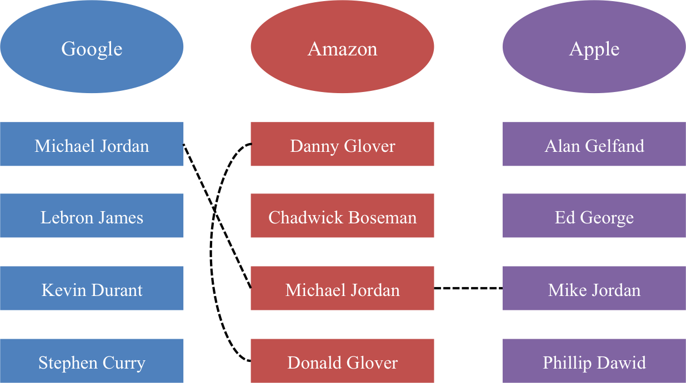
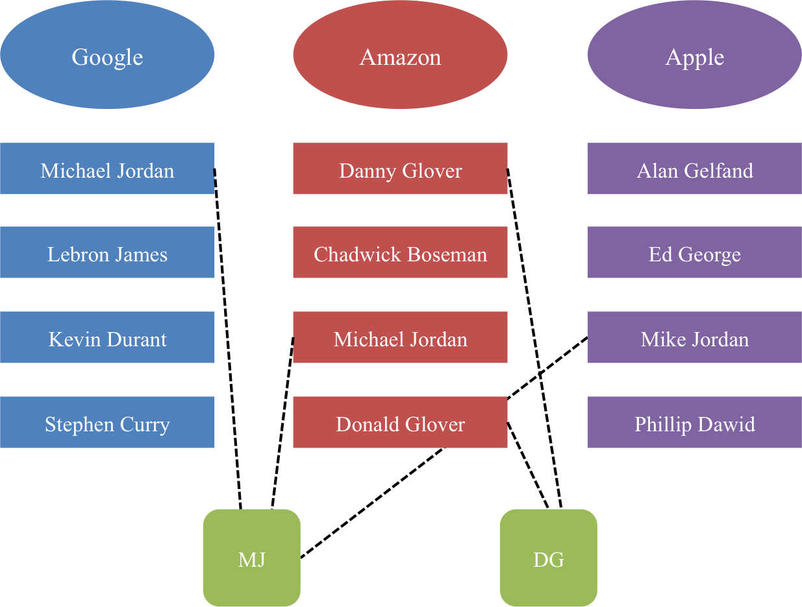
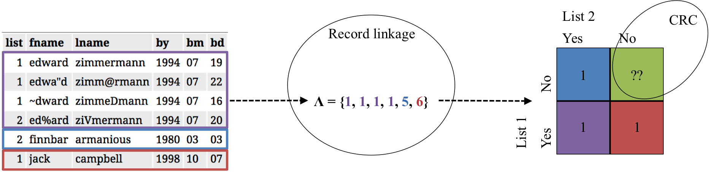

```{r setup, echo = FALSE, message=FALSE, warning=FALSE}
library(knitr)
library(ggplot2)
library(dplyr)
library(tidyr)
library(RefManageR)

opts_chunk$set(echo = FALSE, message=FALSE, warning=FALSE)

## bibliography
options(htmltools.dir.version = FALSE)
BibOptions(check.entries = FALSE, bib.style = "authoryear", style = "markdown", dashed = TRUE)
bib <- ReadBib("refs.bib", check = FALSE)
```

# Motivating example

.pull-left[
```{r nytimes_image}
knitr::include_graphics("figure/nytimes_syria.png")
```
]

.pull-right[

- Duplicated information regarding information about who has died from multiple sources (NGOs)
- Messy overlapping datasets with errors
- String data (names) as identifiers
]

 >  Historically, these numbers matter... because they can have a direct impact on policy, accountability and a global sense of urgency.
 
 **Goal:** We want to count the (population) of casualties and *quantify the uncertainty* in this estimate.

.footnote[[1] https://www.nytimes.com/2018/04/13/world/middleeast/syria-death-toll.html]

---
# General terminology


* *Record linkage* is merging together multiple datasets that have duplicate entries (often in the absence of a unique identifier). 

* A *downstream task* is inference, prediction, or post-linkage analysis on the linked data. 
  - Examples: regression, clustering, small area estimation, sample size estimation, population size estimation, etc.

* *Capture-recapture (CRC)* is a method used to estimate a closed population's size through the use of mark-release-recapture.


---
# Proposed work

* Much work has focused on sample size estimation as the downstream task `r Citep(bib, c("steorts2016bayesian", "chen2017unique", "price2014updated", "sadinle2013generalized"))`
  - Some work on population size estimation post-linkage with uncertainty quantification `r Citep(bib, c("tancredi2011hierarchical", "liseo2011bayesian"))`

* We look at a general fully Bayesian approach, in the context of the downstream task

* Provide framework for record linkage and CRC, where we crucially account for the record linkage and model uncertainty 

---
# Probabilistic record linkage

*Record linkage* is merging together multiple datasets that have duplicate entries (often in the absence of a unique identifier). 

```{r, out.height = "400px"}

```

---
# Latent clustering approach

```{r, out.height = "500px"}

```

---
# Bayesian hierarchical model


---
# Capture-recapture

*Capture-recapture (CRC)* is a method used to estimate a closed population's size through the use of mark-release-recapture.


---
# Bayesian model averaging (BMA)


---
# Bayesian nonparametric latent class model (NPLCM)


---
# Record linkage + CRC
 

 
```{r, results='hide'}
load("../data/geco_sim/geco_5dup_5dist.Rdata")
idx <- do.call(c, identity) == 2

data.frame(list = c(1, 1, 1, 2, 2, 1)) %>%
  bind_cols(do.call(rbind, noisy_dup_db)[idx,] %>% bind_rows(noisy_dup_db[[1]][1:2,])) %>%
  kable(format = "html", row.names = FALSE)
```



---
# Propagating record linkage uncertainty

**Recall Goal: ** We want to count the (population) of casualties and *quantify the uncertainty* in this estimate.

**Challenge: ** How to quantify record linkage uncertainty after the record linkage task in finished and propagate this error into these subsequent analyses?

**One way: **

$$U(\eta) =: E_{\boldsymbol \lambda \mid \boldsymbol X} [p_C(\eta \mid f(\boldsymbol \lambda))] = \sum_{\boldsymbol \lambda} p_C(\eta \mid f(\boldsymbol \lambda)) p(\boldsymbol \lambda \mid \boldsymbol X) = p(\eta \mid \boldsymbol X)$$
$$\text{Var} (\eta \mid \boldsymbol X) = \text{Var}_{\boldsymbol \lambda \mid \boldsymbol X} [E[\eta \mid \boldsymbol \lambda ]] + E_{\boldsymbol \lambda \mid \boldsymbol X} [\text{Var}[\eta \mid \boldsymbol \lambda ]]$$

In practice, $U(\eta)$ and $\text{Var} (\eta \mid \boldsymbol X)$ must be estimated by Markov chain Monte carlo (MCMC).


---
# Another way

- Estimating $U(\eta)$ and $\text{Var} (\eta \mid \boldsymbol X)$ through MCMC can be computationally burdensome.

- Could also consider $p_C(\eta \mid f(\hat{\boldsymbol \lambda}))$, where $\hat{\boldsymbol \lambda}$ is a point estimate for $\boldsymbol \lambda | \boldsymbol X$ given by the shared most probable matching sets `r Citep(bib, "steorts2016bayesian")`

- Upside: Much faster, only need to do MCMC estimation of the CRC for a single linkage value

- Downside: error doesn't propogate through CRC task in an obvious way

---
# Simulated examples

- Generated data in `r length(noisy_dup_db)` lists according to the following stratified capture probabilities

```{r, results='asis'}
inclusion %>%
  mutate(db = paste("List", db)) %>%
  spread(db, inclusion) %>%
  rename(Strata = strata, Proportion = prop) %>%
  kable(digits = 2, format = "html", row.names = FALSE)
```

- Strata correspond to (1) a large & hard to capture population and (2) a small & easy to capture population.

- Add additional duplicates within each database at a 5% level

- Distort the duplicates (both between and within). String fields are distorted at three different levels: $5\%, 10\%, 15\%$ of characters

---
# Simulated data

```{r, results = 'asis'}
noisy_dup_db[[1]] %>%
  tail(10) %>%
  kable(format = "html", row.names = FALSE)
```

---
# Results

---
# Future work + challenges


- MCMC for estimation of $U(\eta)$ and $\text{Var} (\eta \mid \boldsymbol X)$ is **computationally expensive**. Explore how to propogate the error approximately.

- NPLCM CRC method is for independent lists. How to extend for dependency between lists and in our (limited) experience, this CRC method works best for many lists ( $\ge 4$ ). Is very sensitive to errors from RL.

- BMA CRC method does not scale beyond $5$ lists easily because of the need to precompute all possible dependencies between lists. Is less sensitive to errors from RL. [TODO we hope!]

- Much more extensive simulation with different levels of duplication and list inclusion probabilities.

- Do this on **real data**!

```{r, out.height = "150px"}
knitr::include_graphics("figure/do_this.gif")
```


---
# Thank you

## Questions?

### Slides - <http://bit.ly/isba-2018>

### Contact

* Email - <andrea.kaplan@duke.edu>
* Twitter - <http://twitter.com/andeekaplan>
* GitHub - <http://github.com/andeek>

---
# Notation

$\boldsymbol X=(X_1,\ldots,X_n)$, records comprised of $D$ databases, indexed by $i$   

$i$th database has $n_i$ observed records, indexed by $j$  

Each record corresponds to one of $M$ latent entities, indexed by $j'$  

Each record or latent entity has values on $p$ fields, indexed by $\ell$, assumed to be categorical or string  

$M_\ell$, the number of possible categorical values for the $\ell$th field  

$X_{ij\ell}$, observed value of the $\ell$th field for the $j$th record in the $i$th database  

$Y_{j'\ell}$, true value of the $\ell$th field for the $j'$th latent entity  

$\Lambda_{ij}$, latent entity to which the $j$th record in the $i$th database corresponds  

$\boldsymbol \Lambda = \{\Lambda_{ij}: i = 1, \dots, D, j = 1, \dots, n_i\}$   

$z_{ij\ell}=I(X_{ij\ell}\ne Y_{\Lambda_{ij}\ell})$, distortion indicator  

---
# Bayesian hierarchical model for RL

$$X_{ij\ell} \mid \Lambda_{ij},\,Y_{\Lambda_{ij}\ell},\,z_{ij\ell} \stackrel{\text{ind}}{\sim}\begin{cases}\delta(Y_{\Lambda_{ij}\ell})&\text{ if }z_{ij\ell}=0\\F_\ell(Y_{\Lambda_{ij}\ell})&\text{ if }z_{ij\ell}=1, \ell\le p_s\\G_\ell&\text{ if }z_{ij\ell}=1, \ell>p_s\end{cases}$$
$$Y_{j'\ell}\stackrel{\text{ind}}{\sim}G_\ell$$
$$z_{ij\ell}\mid\beta_{i\ell}\stackrel{\text{ind}}{\sim}\text{Bernoulli}(\beta_{i\ell})$$
$$\beta_{i\ell} \mid a,b \stackrel{\text{ind}}{\sim}\text{Beta}(a,b)$$
$$\Lambda_{ij} \mid M\stackrel{\text{ind}}{\sim}\text{Uniform}\left(1,\ldots, M\right)$$


---
# Bayesian nonparametric latent class model

$$f(\boldsymbol q | \boldsymbol \gamma, \boldsymbol \pi) = \sum\limits_{k = 1}^{K^*} \pi_k \prod\limits_{j = 1}^D \gamma_{jk}^{q_j}(1-\gamma{jk})^{1-q_j},$$
$$(\pi_1, \dots, \pi_{K^*}) \sim \text{SB}_{K^*}(\alpha)$$
$$\gamma_{jk} \stackrel{iid}{\sim} \text{Beta}(a_\gamma, b_\gamma)$$
$$\alpha \sim \text{Gamma}(a_\alpha, b_\alpha)$$
$$p(N) \propto \frac{1}{N}$$

---
# Trace plots


---
# Precision and recall


---
# References

.tiny[
```{r print_refs, results='asis'}
PrintBibliography(bib)
```
]
