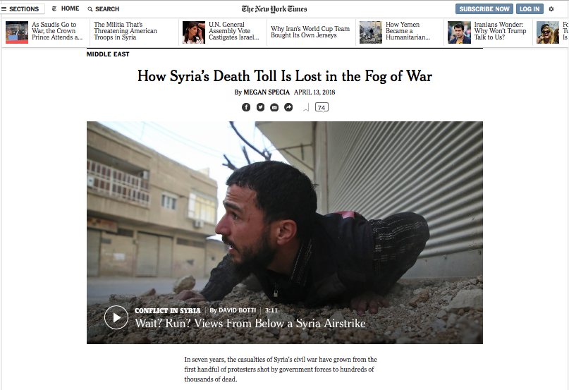
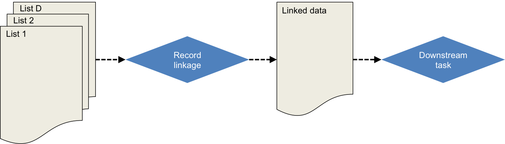
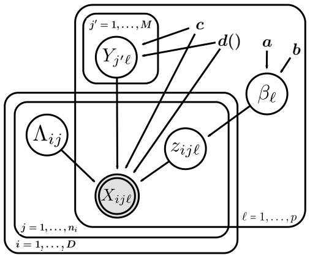

```{r setup, echo = FALSE}
library(knitr)
library(ggplot2)
library(dplyr)
library(tidyr)

opts_chunk$set(echo = FALSE)
```

# Motivating example

.pull-left[
```{r nytimes_image}

```
]

.pull-right[

- Duplicated information regarding information about who has died from multiple sources (NGOs)
- Messy overlapping datasets with errors
- String data (names) as identifiers
]

 >  Historically, these numbers matter... because they can have a direct impact on policy, accountability and a global sense of urgency.
 
 **Goal:** We want to count the (population) of casualties and *quantify the uncertainty* in this estimate.

.footnote[[1] https://www.nytimes.com/2018/04/13/world/middleeast/syria-death-toll.html]

---
# General terminology



* *Record linkage* is merging together multiple datasets that have duplicate entries (often in the absence of a unique identifier). 

* A *downstream task* is inference, prediction, or post-linkage analysis on the linked data. 
  - Examples: regression, clustering, small area estimation, sample size estimation, population size estimation, etc.

* *Capture-recapture (CRC)* is a method used to estimate a closed population's size through the use of mark-release-recapture.


---
# Proposed work

* Much work has focused on sample size estimation as the downstream task [TODO: cite, include HRDAG]
  - Limited work on population size estimation post-linkage with uncertainty quantification [TODO: cite]

* We look at a general fully Bayesian approach, in the context of the downstream task

* Provide framework for record linkage and CRC, where we crucially account for the record linkage and model uncertainty 

---
# Probabilistic record linkage

what is it

---
# Simple example

picture example showing latent clustering idea

---
# Bayesian hierarchical model



---
# Capture-recapture

what is it

---
# Simple example

small example picture + contingency table

---
# Bayesian nonparametric latent class model

---
# Record linkage + CRC
 
```{r}
load("../data/geco_sim/geco_5dup_5dist.Rdata")
idx <- do.call(c, identity) == 2

data.frame(list = c(1, 1, 1, 2, 2, 1)) %>%
  bind_cols(do.call(rbind, noisy_dup_db)[idx,] %>% bind_rows(noisy_dup_db[[1]][1:2,])) %>%
  kable()
```


---
# Propagating record linkage uncertainty

**Recall Goal: ** We want to count the (population) of casualties and *quantify the uncertainty* in this estimate.

**Challenge: ** How to quantify record linkage uncertainty after the record linkage task in finished and propagate this error into these subsequent analyses?

**One way: **

$$U(\eta) =: E_{\boldsymbol \lambda \mid \boldsymbol X} [p_C(\eta \mid f(\boldsymbol \lambda))] = \sum_{\boldsymbol \lambda} p_C(\eta \mid f(\boldsymbol \lambda)) p(\boldsymbol \lambda \mid \boldsymbol X) = p(\eta \mid \boldsymbol X)$$
$$\text{Var} (\eta \mid \boldsymbol X) = \text{Var}_{\boldsymbol \lambda \mid \boldsymbol X} [E[\eta \mid \boldsymbol \lambda ]] + E_{\boldsymbol \lambda \mid \boldsymbol X} [\text{Var}[\eta \mid \boldsymbol \lambda ]]$$

In practice, $U(\eta)$ and $\text{Var} (\eta \mid \boldsymbol X)$ must be estimated by Markov chain Monte carlo (MCMC).


---
# Another way

- Estimating $U(\eta)$ and $\text{Var} (\eta \mid \boldsymbol X)$ through MCMC can be computationally burdensome.

- Could also consider $p_C(\eta \mid f(\hat{\boldsymbol \lambda}))$, where $\hat{\boldsymbol \lambda}$ is the posterior mean of $\boldsymbol \lambda | \boldsymbol X$ (TODO: look up correct statement here) given my the shared most probable matching sets (TODO: cite mpmms)

- Downside: error doesn't propogate through CRC task

---
# Simulated examples

- Generated data in `r length(noisy_dup_db)` lists according to the following stratified capture probabilities

    ```{r}
    inclusion %>%
      mutate(db = paste("List", db)) %>%
      spread(db, inclusion) %>%
      rename(Strata = strata, Proportion = prop) %>%
      kable(digits = 2)
    ```

- Strata correspond to a large & hard to capture population and a small & easy to capture population.

- Add additional duplicates within each database at a 5% level

- Distort the duplicates (both between and within). String fields are distorted at three different levels: $5\%, 10\%, 15\%$ of characters

---
# Results

---
# Future work & Challenges


- MCMC for estimation of $U(\eta)$ and $\text{Var} (\eta \mid \boldsymbol X)$ is **computationally expensive**. Explore how to propogate the error approximately.

- CRC method is for independent lists. How to extend for dependency between lists?

- In our (limited) experience, this CRC method works best for many recaptures ( $\ge 4$ ), but record linkage works best for smaller numbers of lists ( $\le 3$ ). How to navigate this tradeoff?

- Much more extensive simulation with different levels of duplication and list inclusion probabilities.

- Do this on **real data**!

```{r, out.height = "150px"}

```


---
# Thank you

## Questions?

### Slides - <http://bit.ly/isba-2018>

### Contact

* Email - <andrea.kaplan@duke.edu>
* Twitter - <http://twitter.com/andeekaplan>
* GitHub - <http://github.com/andeek>

---
# Notation

---
# Bayesian hierarchical model for record linkage

---
# Bayesian nonparametric latent class model


---
# Trace plots

---
# Precision and recall

---
# References